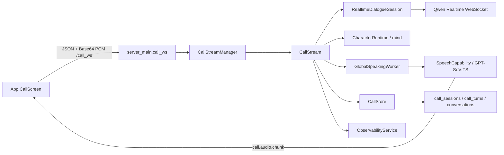

# v0.4.0 电话功能详细设计

本文档是 `docs/PRDs/v0.4.0-电话功能.md` 的实现级设计，目标是把 P0 拆到真实文件、模块、接口、状态和测试边界。PRD 是产品语义的唯一来源；本文负责规定如何在当前仓库中实现。

## 1. 设计结论

1. App 为首个客户端实现，PC 客户端复用同一协议，在 App 主链路稳定后接入。
2. App 在现有抽屉菜单增加“语音通话”。点击后由根布局从聊天屏切换到独立全屏通话屏，聊天屏卸载并关闭 `/chat_ws`。
3. 通话屏使用全屏 WebView 加载现有 `live2d/live2d.html`。模型会随更大的 viewport 放大；不复制第二套 Live2D 运行时和模型资源。
4. Live2D HTML 继续提供 `setExpression` 和 `feedAudioChunk`，同时扩展 `audio_id` 和 `stopAudioPlayback`，使播放完成、打断停止都能准确 ACK。
5. App 的 16 kHz PCM 连续采集使用本地 Expo Module，不使用 `expo-av` 的文件录音接口模拟实时流。
6. `/call_ws` 独立于 `/chat_ws`，但复用认证、心跳、JSON envelope 和错误风格。音频全部使用 JSON Base64。
7. `CallStreamManager` 管理用户和并发；`CallStream` 管理单通电话；Qwen 供应商协议位于 `utils/realtime_dialogue/`，不注册为 capability。
8. `RealtimeDialogueService` 与 `LLMService` 平级，由 `SystemRuntime` 持有并注入 `ChatSessionManager`。每通电话的供应商连接由 `CallStream` 持有。
9. `GlobalSpeakingWorker` 改为“每流 FIFO 队列 + 流头动态优先级”，GPT-SoVITS 实际并发仍为 1。
10. `call_sessions`、`call_turns` 是通话主记录；现有 `conversations` 只保存电话占位项和摘要。

## 2. 当前实现锚点

本设计基于以下现有代码，而不是另建平行体系：

- App 根布局 `app/app/_layout.tsx` 当前直接渲染 `Index`，没有真正的页面栈；偏好和动态也是由主界面状态控制。
- App 菜单位于 `app/app/index.tsx`，当前已有“配置偏好”和“动态”等入口。
- App 聊天 Live2D WebView 在 `app/app/index.tsx` 中只占屏幕高度的 40%；Release 加载 `file:///android_asset/public/live2d/live2d.html`。
- `app/public/live2d/live2d.html` 已提供 `window.setExpression()`、`window.feedAudioChunk()` 和 `audio_finished` 消息。
- App 当前聊天音频桥接由 `app/hooks/useChatLogic.ts` 和 `app/utils/message_processor.ts` 负责，不适合承载电话状态、打断和逐句 ACK。
- `server/src/chat_session/call_stream_manager.py` 已有占位类，应直接替换其实现。
- `server/src/chat_session/chat_session_manager.py` 已创建 `CallStreamManager`，但尚未注入实时对话服务、AgentRuntime 和 observability。
- `server/src/chat_session/dependency/global_speaking_worker.py` 当前是单个 `asyncio.Queue` 的先进先出消费者。
- `server/src/agent_runtime/character_runtime.py::CharacterRuntime.dynamic_context()` 已能提供角色人设和说话风格。
- `server/src/agent/luotianyi_agent.py` 已包含用户画像和偏好的统一格式化逻辑。
- `server/src/chat_session/dependency/conversation_service.py` 已负责 conversation 持久化和上下文格式化。

外部协议依据：

- [阿里云语音到语音模型列表](https://help.aliyun.com/zh/model-studio/s2s-model)：确认模型 ID 为 `qwen-audio-3.0-realtime-flash`，WebSocket 输入支持音频和文本，并支持 Function Calling。
- [Realtime 客户端事件](https://help.aliyun.com/zh/model-studio/client-events)：确认 `input_audio_buffer.append`、`response.cancel`、`conversation.item.create` 和 `response.create` 的基本语义。
- [Realtime 服务端事件](https://help.aliyun.com/zh/model-studio/server-events)：确认 `speech_started`、`speech_stopped`、ASR completed、response 和 usage 事件。

Qwen-Audio 3.0 的模型专属字段仍以百炼控制台对应模型页为准。通用 Realtime 文档只能作为事件骨架，必须通过第 20 节的真实模型契约测试锁定差异。

## 3. 总体架构



边界约束：

- App 不持有 Qwen API Key，也不理解 Qwen 原生事件。
- `/call_ws` 只处理客户端电话协议；Qwen 原生事件只存在于 `utils/realtime_dialogue` 和 `CallStream` 内部。
- `CallStream` 不通过全局 service locator 获取依赖，全部由 `CallStreamManager` 构造时注入。
- 普通通话回复不进入 `LuoTianyiAgent.main_chat`；AgentRuntime 只提供角色上下文、主动话题、记忆和画像接口。

## 4. 文件变更清单

### 4.1 App

| 文件 | 动作 | 职责 |
| --- | --- | --- |
| `app/app/_layout.tsx` | 修改 | 登录后维护 `chat/call` 根屏状态；向聊天页传入发起电话回调；通话结束后返回聊天页 |
| `app/app/index.tsx` | 修改 | 菜单增加“语音通话”；点击前展示耳机提示；调用 `onStartVoiceCall` |
| `app/app/call.tsx` | 新增 | 全屏电话界面，组合 Live2D、状态提示、计时、挂断按钮和请求中蒙版 |
| `app/hooks/useCallLogic.ts` | 新增 | 通话状态机、权限、WebSocket、采集、播放、重连和清理 |
| `app/types/call.ts` | 新增 | 客户端状态、事件 envelope、payload 和错误类型 |
| `app/utils/call_transport.ts` | 新增 | `/call_ws` 连接、鉴权、心跳、快速重连、事件收发和 ACK |
| `app/utils/pcm_recorder.ts` | 新增 | Android 原生 PCM 模块的 JS 监听封装 |
| `app/public/live2d/live2d.html` | 修改 | 支持带 ID 播放、停止当前播放、完成/停止消息 |
| `app/android/app/src/main/assets/public/live2d/live2d.html` | 同步修改 | Release APK 实际读取的 Live2D HTML 镜像 |
| `app/android/app/src/main/java/com/sheepliu712/ailuotianyi/PcmRecorderModule.kt` | 新增 | `AudioRecord` 采集 16-bit/16 kHz/mono PCM 并 Base64 分帧 |
| `app/android/app/src/main/java/com/sheepliu712/ailuotianyi/PcmRecorderPackage.kt` | 新增 | 注册原生录音模块 |
| `app/android/app/src/main/java/com/sheepliu712/ailuotianyi/MainApplication.kt` | 修改 | 注册 `PcmRecorderPackage` |

### 4.2 服务端

| 文件 | 动作 | 职责 |
| --- | --- | --- |
| `server/server_main.py` | 修改 | 新增 `/call_ws`；聊天 ingress 增加 `CALL_IN_PROGRESS` 拒绝 |
| `server/src/system/user_interface/types.py` | 修改 | 增加电话协议事件枚举和 Pydantic payload |
| `server/src/system/user_interface/websocket_service.py` | 修改 | 提取可复用鉴权/心跳；增加失败 ACK 和电话事件发送方法 |
| `server/src/chat_session/call_models.py` | 新增 | `CallState`、退出码、turn、response、playback 等领域对象 |
| `server/src/chat_session/call_stream.py` | 新增 | 单通电话状态机和主编排 |
| `server/src/chat_session/call_stream_manager.py` | 重写 | 注册表、并发限制、用户互斥、重连和过期清理 |
| `server/src/chat_session/call_context_builder.py` | 新增 | 初始 system prompt、最近聊天和电话历史格式化 |
| `server/src/chat_session/call_response_parser.py` | 新增 | Qwen 文本按行解析、语气兜底和 Function Call 分流 |
| `server/src/chat_session/call_memory_pool.py` | 新增 | 记忆池去重、注入、淘汰和 Qwen item 追踪 |
| `server/src/chat_session/call_settlement.py` | 新增 | 幂等结算、摘要、event memory、分段 memory_write 和画像任务 |
| `server/res/agent/prompts/call_system_prompt.json` | 新增 | 电话人设、输出格式、唯一工具、打断和主动话题规则 |
| `server/res/agent/prompts/call_summary_prompt.json` | 新增 | 通话摘要生成及长度约束 |
| `server/src/chat_session/chat_session_manager.py` | 修改 | 注入 RealtimeDialogueService、AgentRuntime、observability、CallStore |
| `server/src/chat_session/chat_stream_manager.py` | 修改 | 提供用户聊天流查询；不负责电话互斥策略 |
| `server/src/chat_session/dependency/conversation_service.py` | 修改 | 最近 10 分钟/20 条查询和 `ContextType.CALL` 格式化 |
| `server/src/chat_session/dependency/global_speaking_worker.py` | 重构 | 每流 FIFO、流头优先级、取消令牌和电话回调 |
| `server/src/utils/realtime_dialogue/models.py` | 新增 | 供应商无关配置和规范化事件 |
| `server/src/utils/realtime_dialogue/session.py` | 新增 | `RealtimeDialogueSession` 协议 |
| `server/src/utils/realtime_dialogue/service.py` | 新增 | 会话工厂 `RealtimeDialogueService` |
| `server/src/utils/realtime_dialogue/qwen_session.py` | 新增 | Qwen WebSocket、事件映射、错误和 usage 解析 |
| `server/src/utils/realtime_dialogue/__init__.py` | 新增 | 对外导出稳定接口 |
| `server/src/system/system_runtime.py` | 修改 | 初始化、持有并注入 `RealtimeDialogueService` |
| `server/src/system/database/sql_database.py` | 修改 | 增加 `CallSession`、`CallTurn` ORM 和索引 |
| `server/src/system/database/call_store.py` | 新增 | 电话记录、逐轮写入、幂等结算和状态更新 |
| `server/src/system/database/database_service.py` | 修改 | 初始化并暴露 `call_store` |
| `server/src/utils/enum_type.py` | 修改 | 增加 `ContextType.CALL` |
| `server/src/system/observability/service.py` | 修改 | 增加电话事件和电话指标查询入口 |
| `server/src/system/admin/config_validator.py` | 修改 | 校验选中的 realtime provider，不枚举未选 provider 配置 |
| `server/config/config.json` | 修改 | 增加实时模型和电话流配置 |
| `server/config/config.json.template` | 修改 | 同步配置结构，不放真实 Key |

### 4.3 PC 客户端和控制台

App 闭环完成后再实现，但 P0 协议不再变化：

| 文件 | 动作 | 职责 |
| --- | --- | --- |
| `client/src/gui/main_ui.py` | 修改 | 主窗口增加电话入口；通话期间禁用聊天区域 |
| `client/src/gui/call_dialog.py` | 新增 | 独立全屏/最大化电话窗口、Live2D、状态、计时和挂断 |
| `client/src/network/call_ws_transport.py` | 新增 | 与 App 相同的 `/call_ws` JSON 协议 |
| `client/src/network/event_types.py` | 修改 | 增加电话事件常量 |
| `client/src/message_process/call_audio_controller.py` | 新增 | 麦克风 PCM、播放队列、停止和 ACK |
| `server/src/system/admin/admin_interface.py` | 修改 | 增加通话摘要列表/详情 API；P0 不返回完整 transcript |
| `server/admin_ui/src/main.tsx` | 后续 | 增加通话记录菜单和摘要、状态、退出码、后处理状态页面 |
| `server/admin_ui/src/styles.css` | 后续 | 通话记录表格、状态徽标和详情布局 |

当前版本已实现管理员摘要 API：`GET /admin/calls`、`GET /admin/calls/{call_id}` 和
`GET /admin/calls-events`；完整 transcript 仍只保存在数据库，不通过管理接口返回。

## 5. App UI 详细设计

### 5.1 根屏切换

当前 `_layout.tsx` 没有使用 `<Stack>`，因此 P0 不引入新的导航架构。增加根屏状态：

```ts
type RootScreen = 'chat' | 'call';

const [screen, setScreen] = useState<RootScreen>('chat');

screen === 'chat'
  ? <Index onStartVoiceCall={() => setScreen('call')} onLogout={logout} />
  : <CallScreen onEnded={() => setScreen('chat')} />;
```

切换到 `call` 后 `Index` 被卸载，`useChatLogic` 的 cleanup 会断开 `/chat_ws`。通话结束后重新挂载 `Index`，重新连接聊天流并恢复聊天能力。服务端仍必须实施聊天互斥，不能依赖客户端卸载保证安全。

Android 返回键规则：

- `REQUESTING`、`ACTIVE`、`RECONNECTING`：拦截返回键，弹出“是否挂断”确认，不直接卸载页面。
- `ENDING`：忽略返回键，等待 `call.ended` 或本地终止超时。
- `ENDED`、致命错误：允许返回聊天页。

### 5.2 菜单入口

在 `app/app/index.tsx` 抽屉中，“动态”之后增加：

```tsx
<TouchableOpacity onPress={handleStartVoiceCall} ...>
  <Text ...>语音通话</Text>
</TouchableOpacity>
```

点击流程：

1. 关闭抽屉。
2. 使用 `Alert.alert` 提示“当前版本请使用耳机，扬声器模式可能导致错误打断”。
3. 用户确认后进入 `CallScreen`；取消则留在聊天页。
4. `CallScreen` 取得麦克风权限成功后才连接 `/call_ws`。权限拒绝不发送 `call.start`。

### 5.3 全屏布局和层级

`app/app/call.tsx` 使用全屏根 `View`，不保留聊天页顶部 40% 的高度限制。

| zIndex | 层 | 说明 |
| --- | --- | --- |
| 0 | 背景图 | 复用 `app/assets/live2d/backgrounds/bg2.jpg`，`resizeMode="cover"` |
| 10 | Live2D WebView | `StyleSheet.absoluteFillObject`，占满屏幕；模型由 viewport 自动放大 |
| 20 | 状态和计时 | 顶部安全区内显示“正在请求/通话中/正在重连”和时长 |
| 30 | 挂断按钮 | 水平居中，圆心位于屏幕高度约 82%；直径 72dp，纯红色圆形 |
| 40 | 磨砂蒙版 | 尚未接通时覆盖 Live2D 和挂断按钮；灰色低透明度 |
| 50 | 加载/错误短文案 | 蒙版中央显示状态，不显示 transcript |

当前实现使用不拦截触摸的半透明灰色 View 作为 P0 蒙版；后续可替换为 `expo-blur` 的 `BlurView`：

```tsx
<BlurView
  pointerEvents="none"
  intensity={24}
  tint="dark"
  style={[StyleSheet.absoluteFillObject, styles.connectingMask]}
/>
```

`connectingMask` 叠加 `rgba(96, 96, 96, 0.24)`。蒙版在 `IDLE` 初始化、`REQUESTING` 和 `RECONNECTING` 显示，进入 `ACTIVE` 后移除。`pointerEvents="none"` 让视觉蒙版覆盖挂断按钮但点击仍能穿透到底层按钮，因此接通前可以挂断。`RECONNECTING` 显示“正在恢复通话…”，避免用户误以为麦克风仍在正常发送。若尚未取得 `call_id` 就点击挂断，只清理本地资源并返回聊天页，不向服务端发送事件。

P0 挂断按钮只使用红色圆圈，不引入电话图标；按下态透明度降至 0.75。按钮的可点击范围至少 88dp，视觉圆仍为 72dp。

### 5.4 Live2D WebView

当前 `app/app/index.tsx` 和 `app/app/call.tsx` 各自构造 Dev/Release Live2D URL，并使用 WebView 白名单：

```ts
const live2dUrl = `${webRoot}live2d/live2d.html?mode=call`;
```

Dev 继续加载 `http://${Constants.expoConfig.hostUri}/live2d/live2d.html`；Release 继续加载 `file:///android_asset/public/live2d/live2d.html`。全屏 viewport 会使现有 `resizeModel()` 计算出更大的模型尺寸，不创建 `call_live2d.html`。

当前 WebView 对外接口为：

```js
window.setExpression(expressionId)
window.feedAudioChunk(base64Audio, isFinal, audioId, responseId)
window.stopAudioPlayback()
```

WebView 发回 App：

```json
{"type":"modelLoaded","success":true}
{"type":"audio_finished","audio_id":"audio-...","response_id":"response-..."}
{"type":"audio_stopped","audio_id":"audio-...","response_id":"response-..."}
```

HTML 必须保存当前 `AudioBufferSourceNode` 集合。`stopAudioPlayback()` 停止全部当前 source，清空时间轴并为未完成的 `audio_id` 发出 `audio_stopped`。停止和完成事件对同一个 `audio_id` 至多发出一个。

聊天页仍可传空 `audioId`；`useChatLogic` 继续只关心 `audio_finished`。通话页必须传真实 `audio_id`。

两个 HTML 文件必须保持字节级同步：

- 开发源：`app/public/live2d/live2d.html`
- Android Release 镜像：`app/android/app/src/main/assets/public/live2d/live2d.html`

Release 验证必须检查 APK 内 `assets/public/live2d/live2d.html`，不能只在 Expo Dev Server 验证。

### 5.5 App 通话状态

`app/types/call.ts` 当前使用小写 UI 状态：

```ts
export type CallStatus = 'idle' | 'connecting' | 'requesting' | 'active' | 'reconnecting' | 'ending' | 'ended';
```

`useCallLogic` 对外接口：

```ts
export function useCallLogic(
  webviewRef: React.RefObject<WebView | null>,
  username: string,
  messageToken: string,
  onEnded: () => void,
  enabled?: boolean,
): {
  status: CallStatus;
  error: string | null;
  elapsedSeconds: number;
  startCall(): Promise<CallAckResult | undefined>;
  hangup(): Promise<CallAckResult | undefined>;
  handleWebViewMessage(event: WebViewMessageEvent): void;
};
```

计时从 `call.connected.connected_at` 开始，不从页面进入或 `call.requested` 开始。客户端计时只用于显示，最终时长以服务端 `call.ended.duration_seconds` 为准。

### 5.6 麦克风 PCM 模块

`expo-av` 适合录制文件和普通播放，不提供本设计所需的稳定、低延迟原始 PCM 回调。当前直接在 Android 工程注册原生模块：

```text
app/utils/pcm_recorder.ts
app/android/app/src/main/java/com/sheepliu712/ailuotianyi/PcmRecorderModule.kt
app/android/app/src/main/java/com/sheepliu712/ailuotianyi/PcmRecorderPackage.kt
```

JS 接口：

```ts
class PcmRecorder {
  start(onChunk: (chunk: { seq: number; audio: string }) => void): Promise<void>;
  stop(): Promise<void>;
}
```

Android 使用 `AudioRecord` 直接请求 PCM16/16 kHz/mono，在 native 线程以 2048-byte 分帧向 JS 发 Base64，不加 WAV 头；设备不支持目标格式时由 recorder 启动失败并记录错误，P0 不在 JS 层伪造采样率。

采集生命周期：

- `REQUESTING`：完成权限和 recorder 初始化，但不向服务端发送音频。
- 收到 `call.connected`：开始采集并发送。
- `RECONNECTING`：立即停止采集，不缓存断线音频。
- `call.resumed`：重新开始采集，`seq` 延续递增。
- `ENDING/ENDED`：停止并释放 `AudioRecord`。

### 5.7 电话音频播放控制器

当前没有单独的 `CallAudioController` 文件；播放 ID、停止和 ACK 由 `useCallLogic` 与 `live2d.html` 协作完成：

`useCallLogic` 将 `call.audio.chunk` 注入 `window.feedAudioChunk(audio,isFinal,audioId,responseId)`；HTML 用 WebAudio 时间轴按到达顺序播放，并对每个 `audio_id` 回发完成/停止消息。

规则：

1. 服务端每个 `audio_id` 的 `seq` 从 0 递增；WebView 按收到的分片和时间轴顺序播放。
2. 句子之间不交叉播放；下一句可以提前注入 WebView，但开始时间晚于上一句。
3. `audio_finished` 后发送 `call.playback_completed`。
4. 收到 `call.stop_playback` 后清空当前播放时间轴，并为未完成句发送 `call.playback_stopped`。
5. ACK 表示播放器确实停止，而不是仅表示已收到服务端命令；已取消 response 的迟到包一律丢弃。

### 5.8 `/call_ws` Transport

`CallTransport` 与聊天 transport 分离，避免两个状态机互相污染：

```ts
class CallTransport {
  start(): void;
  stop(): void;
  startCall(): Promise<CallAckResult>;
  appendAudio(audio: string, seq: number): void;
  hangup(): Promise<CallAckResult>;
  playbackCompleted(audioId: string, responseId?: string): void;
  playbackStopped(audioId: string, responseId?: string): void;
}
```

参数：

- 心跳周期：10 秒；服务端连接断开后进入 5 秒重连保留期。
- 客户端以约 2 秒间隔重连，重新认证后使用原 `call_id` 发送 `call.resume`。
- 进入 `RECONNECTING` 时停止录音，不缓存或跨断线补发音频帧。
- 音频和控制消息统一使用 JSON；单帧为 native `AudioRecord` 的 2048-byte PCM Base64 数据。

## 6. 客户端电话协议

### 6.1 Envelope

沿用聊天协议：

```json
{
  "type": "call.audio.append",
  "client_msg_id": "c-...",
  "ts": 1780000000000,
  "payload": {}
}
```

服务端事件保持 `type + payload`，需要关联客户端消息时增加 `reply_to`。认证仍先发送 `user_auth`，payload 为 `username` 和 `token`。

### 6.2 客户端事件 payload

```ts
interface CallStartPayload {
  character_id: 'luotianyi';
  audio: { format: 'pcm16'; sample_rate: 16000; channels: 1 };
}

interface CallResumePayload { call_id: string; }
interface CallAudioAppendPayload { call_id: string; seq: number; audio: string; }
interface CallHangupPayload { call_id: string; }
interface PlaybackIds { call_id: string; response_id: string; audio_id: string; }
```

`call.start`、`call.resume`、`call.hangup` 和两个 playback 事件需要 ACK；高频 `call.audio.append` 不逐包 ACK，依靠 `seq`、连接状态和 observability 检测丢失。

### 6.3 服务端音频事件

```ts
interface CallAudioChunkPayload {
  call_id: string;
  response_id: string;
  audio_id: string;
  seq: number;
  audio: string;
  is_final: boolean;
  expression?: string;
  audio_format?: 'wav' | 'pcm16';
}
```

GPT-SoVITS 第一包通常带 WAV 头，后续包沿用现有流式格式；WebView 继续从首包解析 sample rate 和 channel。服务端每个 `audio_id` 的 `seq` 从 0 递增，最后一包必须 `is_final=true`，即使音频内容为空也应发送终止包。

### 6.4 错误和 ACK

成功 ACK：

```json
{"type":"server_ack","reply_to":"c-1","payload":{"ok":true}}
```

业务拒绝 ACK：

```json
{
  "type":"server_ack",
  "reply_to":"c-1",
  "payload":{"ok":false,"code":"CALL_IN_PROGRESS","message":"用户正在通话"}
}
```

`server_error` 用于无法关联请求的协议错误或连接级错误。客户端不能把收到 `server_ack` 一律解释为成功，现有 `app/utils/ws_transport.ts` 和 PC transport 都要读取 `payload.ok`。

### 6.5 服务端控制事件 payload

```ts
interface CallRequestedPayload {
  call_id: string;
  requested_at: string;
  accept_after_ms: 2000;
}

interface CallConnectedPayload {
  call_id: string;
  connected_at: string;
}

interface CallReconnectingPayload {
  call_id: string;
  reconnect_deadline: string;
}

interface CallResumedPayload {
  call_id: string;
  resumed_at: string;
}

interface CallStopPlaybackPayload {
  call_id: string;
  response_id: string;
  audio_ids: string[];
  reason: 'user_barge_in' | 'hangup' | 'disconnect' | 'provider_cancelled';
}

interface CallEndedPayload {
  call_id: string;
  exit_code: number;
  duration_seconds: number;
  ended_at: string;
}

interface CallRejectedPayload {
  call_id?: string;
  exit_code: -5 | -2 | -4;
  code: string;
  message: string;
}
```

`call.error` 还包含 `recoverable: boolean`。可恢复错误只展示短提示；不可恢复错误随后必须有 `call.ended` 或 `call.rejected`，客户端不能永久停留在 `ENDING`。

## 7. 服务端领域模型和主要接口

### 7.1 `call_models.py`

```py
class CallState(str, Enum):
    IDLE = "IDLE"
    REQUESTING = "REQUESTING"
    ACTIVE = "ACTIVE"
    RECONNECTING = "RECONNECTING"
    ENDING = "ENDING"
    ENDED = "ENDED"

class CallExitCode(IntEnum):
    NORMAL = 0
    HANGUP_BEFORE_CONNECTED = 1
    RECONNECT_TIMEOUT = -1
    REALTIME_PROVIDER_FAILED = -2
    TTS_FAILED = -3
    INTERNAL_ERROR = -4
    CONCURRENCY_REJECTED = -5
```

另定义 `CallTurnDraft`、`CallResponseState`、`PlaybackState` 和 `CallTTSLine`。所有对象携带 `call_id`；response 和播放对象还必须携带 `response_id`、`audio_id`。

### 7.2 `CallStreamManager`

内部索引：

```py
self._streams_by_call_id: dict[str, CallStream]
self._call_id_by_user_id: dict[str, str]
self._lock = asyncio.Lock()
```

主要接口：

```py
async def start_call(
    self,
    *,
    ws_connection: WebSocketConnection,
    character_id: str,
    client_request_id: str,
) -> CallStream

async def resume_call(
    self,
    *,
    ws_connection: WebSocketConnection,
    call_id: str,
) -> CallStream

def get_by_call_id(self, call_id: str) -> CallStream | None
def has_blocking_call(self, user_id: str) -> bool
async def on_ws_lost(self, ws_connection: WebSocketConnection) -> None
async def release(self, call_id: str) -> None
async def cleanup_expired_streams(self) -> None
```

约束：

- 容量计数包括 `REQUESTING`、`ACTIVE`、`RECONNECTING`。
- 检查用户重复电话、全局 5 路限制和注册 stream 必须在同一个 lock 临界区完成。
- 第 6 路返回 `-5`，不创建 `CallStream`、数据库记录或 conversation。
- 同一用户已有阻塞电话时，`call.start` 返回 `CALL_IN_PROGRESS`；只有原 `call_id` 可 resume。
- `on_ws_lost` 不删除 stream，只切换 `RECONNECTING` 并启动 5 秒 deadline task。

### 7.3 `CallStream`

构造函数只接收明确依赖：

```py
class CallStream:
    def __init__(
        self,
        *,
        call_id: str,
        user_id: str,
        user_name: str,
        character_id: str,
        ws_connection: WebSocketConnection,
        config: dict,
        realtime_dialogue_service: RealtimeDialogueService,
        conversation_service: ConversationService,
        global_speaking_worker: GlobalSpeakingWorker,
        proactive_topic_maker: ProactiveTopicMaker,
        agent_runtime: AgentRuntime,
        call_store: CallStore,
        observability: ObservabilityService,
    ): ...
```

主要接口：

```py
async def start(self) -> None
async def append_user_audio(self, *, seq: int, pcm_base64: str) -> None
async def handle_client_event(self, event: WSMessage) -> None
async def reconnect(self, ws_connection: WebSocketConnection) -> None
async def lost_connection(self) -> None
async def hangup(self) -> None
async def end(self, exit_code: CallExitCode, reason: str) -> None
```

内部任务：

- `_provider_reader_task`：消费规范化 Qwen 事件。
- `_request_delay_task`：从服务端收到 `call.start` 起计时 2 秒。
- `_reconnect_timeout_task`：断线后 5 秒终止。
- `_proactive_timer_task`：满足空闲条件后等待 2 秒。
- `_postprocess_tasks`：摘要、记忆、画像等异步任务；不阻塞 `call.ended`。

状态迁移统一经过 `_transition(expected, target)`，禁止业务代码直接赋值。`end()` 使用 `asyncio.Lock` 和 `_end_seq` 保证单进程幂等；数据库再以 `call_id + end_seq` 保证持久层幂等。

`start()` 的 2 秒时序固定为：

1. 立即发送 `call.requested` 并记录服务端接收时间。
2. 同时启动 `sleep(2s)` 和“构造上下文 + 建立 Qwen session”任务。
3. 两个任务都成功后才创建 active call session、切换 `ACTIVE` 并发送 `call.connected`。
4. 用户在此期间挂断：取消 Qwen 准备任务，按退出码 1 创建电话记录和 conversation。
5. Qwen 准备失败：仍等到固定 2 秒结束再返回 `-2`；未进入 ACTIVE，不写业务表。

固定 2 秒是最短接听等待，不要求 Qwen 建连必须延迟到 2 秒后才开始。这样能把供应商建连耗时隐藏在接听等待中，同时仍保证产品可见的 2 秒延时。

### 7.4 `RealtimeDialogueService`

该模块位于 `utils` 的原因是它描述“如何调用实时模型”，而不是“洛天依能做什么”。唱歌、说话和图片理解是角色可执行能力；Qwen Realtime 连接只是电话编排使用的供应商基础设施。

```py
class RealtimeDialogueService:
    def __init__(self, config: dict): ...

    async def create_session(
        self,
        *,
        trace_id: str,
        call_id: str,
        instructions: str,
        tools: list[RealtimeToolDefinition],
    ) -> RealtimeDialogueSession: ...
```

供应商无关 session：

```py
class RealtimeDialogueSession(Protocol):
    async def connect(self) -> None: ...
    async def append_audio(self, pcm_base64: str) -> None: ...
    async def append_context_item(self, *, role: str, text: str, item_id: str) -> str: ...
    async def delete_context_item(self, item_id: str) -> None: ...
    async def submit_tool_result(self, *, call_id: str, output: str) -> None: ...
    async def request_response(self) -> None: ...
    async def cancel_response(self) -> None: ...
    def events(self) -> AsyncIterator[RealtimeEvent]: ...
    async def close(self) -> None: ...
```

Qwen adapter 把下列原生事件映射为领域事件：

- `input_audio_buffer.speech_started`
- `input_audio_buffer.speech_stopped`
- `conversation.item.input_audio_transcription.completed`
- `response.created`
- 文本 delta/done
- `response.output_item.added/done`
- 原生 `function_call` item 和 arguments done
- `response.done`
- `error`

Qwen session 配置必须使用 server VAD、16 kHz PCM 输入和文本输出。任何 Qwen 音频输出都丢弃并记录协议告警。工具结果通过 `conversation.item.create` 的 `function_call_output` 返回，然后发送 `response.create`。

当前阿里云 Realtime 官方客户端事件文档规定 `conversation.item.create` 仅接受
`function_call_output`；因此 Qwen 适配器默认使用 `session.update.instructions` 维护
role/text 追加上下文和记忆池，仍保留 `conversation_item` 传输模式供未来通过供应商契约测试的实现使用。
该差异封装在 `server/src/utils/realtime_dialogue/qwen_session.py`，不扩散到 `CallStream` 或
`CallMemoryPool`；工具结果仍严格使用 `conversation.item.create(function_call_output)`。

供应商 API 在不同实时模型间存在事件和上下文注入能力差异。实现前必须用目标模型执行契约测试，确认：文本输出事件、Function Calling、上下文 item 注入/删除、`response.cancel` 和 usage 字段。若目标模型不能注入/删除 system item，不能在 `CallStream` 中写供应商特判；应由 Qwen adapter 选择该模型支持的等价上下文更新方式，并保持上述 session 接口不变。

## 8. 初始上下文和角色数据

### 8.1 `CallContextBuilder`

```py
@dataclass(frozen=True)
class InitialCallContext:
    system_prompt: str
    recent_history_item: str
    start_request_item: str

class CallContextBuilder:
    async def build(
        self,
        *,
        user_id: str,
        character_id: str,
    ) -> InitialCallContext: ...
```

数据来源：

| 内容 | 来源 |
| --- | --- |
| 洛天依人设、表达偏好 | `AgentRuntime.get_character_runtime(character_id).dynamic_context()` 返回的 `character_persona`、`speaking_style` |
| 用户画像 | `DatabaseManager.get_user_description(user_id)` |
| 用户偏好 | `DatabaseManager.get_user_preferences(user_id)`，使用 Agent 公开格式化接口 |
| 最近聊天 | `ConversationService.get_recent_items(..., since_minutes=10, limit=20)` |
| 电话行为规则 | `server/res/agent/prompts/call_system_prompt.json`，当前由 `CallContextBuilder` 拼入动态 system prompt |

为避免电话复制私有方法，将 `LuoTianyiAgent._load_user_expression_context()` 提升为公开的 `load_user_expression_context(user_id)`；聊天和电话都调用同一方法。不要在 `CallContextBuilder` 再实现一套 relationship、speaking_style、personality_traits、custom_context 解析。

初始顺序：

1. 建立供应商连接并设置 system instructions：人设、表达偏好、用户画像、用户偏好、电话规则、语气格式和唯一工具。
2. 最近 10 分钟且最多 20 条消息按时间升序拼成一个 `role=user` item。
3. 再追加一个 `role=user` item：“用户发起了语音电话。”，只存在于 CallStream/Qwen 上下文。

最近历史不读取 `ConversationContext.summary`。格式：

```text
[用户] ...
[洛天依] ...
[唱歌] 洛天依唱了《...》：...
[图片描述] ...
[语音通话] 语音通话120秒：...
```

图片项只放已有视觉识别结果，不能重新调用 VLM。`ContextType.CALL` 摘要为空时只放时长。

## 9. Qwen 回复、记忆和主动话题

### 9.1 文本解析

`CallResponseParser` 按 `response_id` 保存文本 buffer：

```py
def feed_text_delta(response_id: str, delta: str) -> list[CallTTSLine]
def flush_response(response_id: str) -> list[CallTTSLine]
def cancel_response(response_id: str) -> None
```

- 以 `\n` 为完整行边界。
- 行格式为 `[语气]内容`；语气无法解析时使用语音 capability 的默认语气，但保留并朗读内容。
- 空行跳过。
- `response.done` 时 flush 没有换行的尾行。
- 原生 `item.type=function_call` 不经过文本 parser，也不进入 TTS。
- response 一旦 cancelled，后续 delta 和 flush 结果全部丢弃。

### 9.2 `search_memory`

Qwen 唯一工具：

```json
{
  "name": "search_memory",
  "description": "检索洛天依与当前用户相关的长期记忆",
  "parameters": {
    "type": "object",
    "properties": {
      "queries": {"type":"array","items":{"type":"string"},"maxItems":5}
    },
    "required": ["queries"]
  }
}
```

执行路径：

```py
CharacterRuntime.mind.search_memory_context_for_topic(
    user_id=user_id,
    queries=queries,
    similarity_threshold=0.8,
    k=10,
)
```

返回的 `MemoryHit.record.id` 作为 `memory_id`；旧向量没有 record 时使用稳定的 `vector_id`，不能用渲染文本做主键。

工具调用异步执行。Qwen 在同一响应先产生“我想想”等普通行时，该行照常进入 TTS；工具结果回来后提交 `function_call_output` 并触发 `response.create`。同一通电话的播放控制器和 TTS 流 FIFO 保证正式回复不会越过“我想想”。

### 9.3 `CallMemoryPool`

```py
@dataclass
class InjectedMemory:
    memory_id: str
    qwen_item_id: str
    injected_at: float

async def add_hits(hits: Sequence[MemoryHit]) -> MemoryPoolResult
async def clear() -> None
```

池内用 `OrderedDict[str, InjectedMemory]`。已存在 memory_id 不重复注入。新增不超过 10 条时，注入后从最早项开始删除到总数 10；本轮新增超过 10 条时先删除全部旧项，再完整保留本批。删除调用 `RealtimeDialogueSession.delete_context_item()`。

工具结果固定为三类：`新增记忆 N 条`、`没有更多记忆`、`记忆搜索失败`。失败不能终止电话。

### 9.4 主动话题

`CallStream` 只在以下条件全部成立时启动 2 秒 timer：

- Qwen 当前 response 已 `response.done`；
- 当前 response 所有 `audio_id` 已 `playback_completed`；
- 没有未完成 function call；
- 本电话流没有排队或运行中的 TTS；
- 当前未检测到用户说话。

timer 到期后调用现有 Agent/LLM 生成主动话题文本，再作为一个新的 `role=user` 上下文增量交给 Qwen。主动话题本身不直接 TTS。用户 `speech_started`、挂断、断线或新的 response 均取消 timer。

## 10. 打断和逐轮落库

### 10.1 `speech_started`

收到 Qwen `input_audio_buffer.speech_started` 后，按顺序执行：

1. 取消主动话题 timer。
2. 若存在生成中的 response，调用 `response.cancel`。
3. 将 response 标记 cancelled，parser 丢弃后续文本。
4. 调用 `GlobalSpeakingWorker.cancel_pending(response_id=...)` 删除尚未开始的 TTS。
5. 活跃 GPT-SoVITS job 设置取消令牌；底层生成器不能安全中止时允许其结束，但 callback 不再向客户端转发。
6. 发送 `call.stop_playback`。
7. 等待客户端 `call.playback_stopped`；记录从 speech_started 到 ACK 的耗时。

客户端停止 ACK 目标是 1 秒。服务端等待 3 秒仍未收到时记录 `playback_stop_ack_timeout`，但通话继续。

### 10.2 turn 生成规则

- 用户：只在 `conversation.item.input_audio_transcription.completed` 后创建 `speaker=user` turn。
- 洛天依：TTS 文本生成时只建立内存 draft；收到匹配的 `call.playback_completed` 才创建 `speaker=assistant` turn。
- 被取消、停止、缺包、ACK 超时的 assistant draft 不落库，也不计 memory_write 行数。
- `call.playback_completed` 和 `call.playback_stopped` 都按 `(call_id, response_id, audio_id)` 幂等；迟到 ACK 只记录，不改变已终止状态。

## 11. GlobalSpeakingWorker 重构

### 11.1 数据结构

`SpeakingJob` 增加：

```py
stream_id: str
stream_seq: int
estimated_seconds: float
response_id: str | None
audio_id: str | None
cancel_token: CancellationToken
```

worker 内部：

```py
self._stream_queues: dict[str, deque[SpeakingJob]]
self._last_started_at: dict[str, float]
self._condition: asyncio.Condition
self._active_job: SpeakingJob | None
```

每次只比较各流队首。ChatStream 使用 `chat:{character_id}:{user_id}`；CallStream 使用 `call:{call_id}`。同一流内按 `stream_seq` 严格 FIFO。

### 11.2 优先级

```text
T_est = max(len(sound_text) / 200 * 60, 0.3) 秒
p = max((now - last_started_at[stream_id]) / T_est, 1)
```

新流没有历史任务时 `p=1`。每次选择任务时重新计算所有流头优先级，取最大值；同优先级使用最早入队时间稳定排序。`last_started_at` 在任务开始处理时更新。任务开始后不被普通高优先级任务抢占。

`cancel_pending()` 可以删除尚未开始的指定 call/response/audio job。活跃 job 只能通过 cancellation token 停止转发和尽力关闭生成器。

### 11.3 接口

```py
async def enqueue(self, job: SpeakingJob) -> None
async def cancel_pending(
    self,
    *,
    stream_id: str,
    response_id: str | None = None,
    reason: str,
) -> int
def has_work(self, stream_id: str) -> bool
```

队列上限从“全局 512”改为全局总数 512、单流 64。达到单流上限时电话按内部错误结束，不能无限积压内存。

## 12. 数据库设计

### 12.1 ORM

`call_sessions`：

| 字段 | 类型/约束 |
| --- | --- |
| `call_id` | String PK |
| `user_id` | FK `users.uuid`, not null, on delete cascade, index |
| `character_id` | String, not null, index |
| `status` | String, not null |
| `requested_at` | DateTime, not null |
| `connected_at` | DateTime, nullable |
| `ended_at` | DateTime, nullable |
| `duration_seconds` | Integer, default 0 |
| `exit_code` | Integer, nullable, index |
| `summary` | Text, nullable |
| `summary_status/error` | String/Text |
| `memory_status/error` | String/Text |
| `profile_status/error` | String/Text |
| `conversation_id` | FK `conversations.uuid`, nullable, unique |
| `end_seq` | Integer, default 0 |
| `created_at/updated_at` | DateTime |

`call_turns`：

| 字段 | 类型/约束 |
| --- | --- |
| `id` | Integer PK autoincrement |
| `call_id` | FK `call_sessions.call_id`, on delete cascade, index |
| `seq` | Integer, not null |
| `speaker` | String (`user`/`assistant`) |
| `text` | Text, not null |
| `started_at/ended_at` | DateTime, nullable |
| `raw_events_json` | Text, nullable，已剥离 Base64 |
| `created_at` | DateTime |

约束：`UniqueConstraint(call_id, seq)`。用户删除时由 `call_sessions.user_id` cascade，turn 再由 call cascade。

### 12.2 `CallStore`

```py
class CallStore:
    def create_active_session(self, session: CallSessionCreate) -> None
    def create_preconnect_hangup_and_conversation(...) -> str
    def append_turn(self, turn: CallTurnCreate) -> int
    def settle_call_and_conversation(self, settlement: CallSettlement) -> str
    def update_summary(self, call_id: str, summary: str, status: str, error: str | None) -> None
    def update_memory_status(self, call_id: str, status: str, error: str | None) -> None
    def update_profile_status(self, call_id: str, status: str, error: str | None) -> None
    def list_turns(self, call_id: str) -> list[CallTurn]
```

`settle_call_and_conversation()` 在一个 SQL transaction 内：

1. 以 `call_id/end_seq` 判断是否已经结算。
2. 更新 call session ended 状态。
3. 若没有 conversation，则插入 `type=ContextType.CALL`、`content=语音通话<时长>`。
4. `meta_data` 只序列化 `{"summary":"..."}`。
5. 回写 `conversation_id`。

重复调用返回已有 conversation ID，不重复插入。目标一致率为 100%，任何事务失败写 observability 并由结算重试任务处理。

### 12.3 最近上下文

`ConversationService` 新增：

```py
async def get_recent_items(
    self,
    user_id: str,
    *,
    character_id: str,
    since: datetime,
    limit: int,
) -> list[dict[str, Any]]
```

数据库查询先按时间倒序取最多 20 条，再在 service 中恢复升序。图片使用 `content` 中已有描述；CALL 从 `meta_data.summary` 格式化。现有普通聊天 `_format_conversations()` 同时增加 CALL 分支，使后续聊天上下文显示电话摘要。

## 13. 记忆写入、摘要和画像

`CallSettlementCoordinator` 维护已确认 turn 的 10 行窗口：

```py
async def on_committed_turn(turn: CallTurn) -> None
async def flush_memory_tail() -> None
async def settle(exit_code: int) -> None
```

- 每累计 10 行，创建一个异步 memory_write job。
- job 幂等键为 `call_id:{start_seq}:{end_seq}`，失败重试两次。
- 通话结束不足 10 行仍执行一次；没有剩余行则不重复写。
- 正常结束后生成摘要、写 event memory、更新用户画像。
- 非 0、未接通、异常断线、Qwen/TTS/内部错误均不更新画像。
- 摘要第一次超过 200 字重试；第二次仍超过 200 字截断 100 字。
- `call.ended` 在业务记录事务完成后立即发送；摘要、memory 和 profile 状态随后异步更新。

## 14. SystemRuntime 依赖装配

`SystemRuntime` 增加字段：

```py
realtime_dialogue_service: RealtimeDialogueService
```

初始化顺序：

1. Observability
2. LLMService
3. RealtimeDialogueService
4. DatabaseManager（含 CallStore）
5. CapabilityManager
6. ChatSessionManager
7. WorldRuntime
8. AgentRuntime
9. 统一 wire dependencies

由于 `ChatSessionManager` 创建时 AgentRuntime 尚未完成，可保持构造时只传基础 service，在 `_wire_dependencies()` 中再注入 `agent_runtime`、`realtime_dialogue_service` 和 `observability`。`CallStreamManager.ensure_dependencies()` 必须检查这些依赖，不允许保留当前只检查 config 的占位实现。

## 15. 服务端 `/call_ws` 处理流程

`server_main.py` 新增：

```py
@app.websocket("/call_ws")
async def call_ws(websocket: WebSocket): ...
```

流程：

1. accept，若 SystemRuntime 未就绪发送 `system_not_ready` 并以 1013 关闭。
2. 发送 `system_ready`。
3. 复用 `WebSocketConnection.auth()` 完成 message token 鉴权。
4. 循环读取事件；心跳交给 `WebSocketService`。
5. `call.start` 调用 `CallStreamManager.start_call()`。
6. `call.resume` 调用 `resume_call()` 并绑定原 stream。
7. 其余事件必须已有绑定 stream，交给 `CallStream.handle_client_event()`。
8. WebSocketDisconnect 时调用 `CallStreamManager.on_ws_lost()`，不能直接结算。

聊天 `/chat_ws` 在发送成功 ACK 前检查：

```py
if websocket_service.is_chat_related_event(event) \
   and call_stream_manager.has_blocking_call(ws_connection.user_uuid):
    await websocket_service.send_rejected_ack_event(
        ws_connection,
        event,
        code="CALL_IN_PROGRESS",
        message="语音通话进行中，暂时不能发送聊天消息",
    )
    continue
```

阻塞状态只包括 `REQUESTING`、`ACTIVE`、`RECONNECTING`。`ENDING` 已不接收电话音频，但在结算完成前客户端仍停留电话页；服务端可继续拒绝以避免极短竞态，收到 `call.ended` 后解除。

## 16. 配置

`server/config/config.json` 和 template 同步增加：

```json
{
  "realtime_dialogue_service": {
    "provider": "qwen",
    "qwen": {
      "api_key": "$QWEN_API_KEY",
      "model": "qwen-audio-3.0-realtime-flash",
      "base_url": "$QWEN_REALTIME_BASE_URL",
      "connect_timeout_seconds": 3,
      "event_timeout_seconds": 30,
      "input_audio_format": "pcm",
      "input_sample_rate": 16000,
      "output_modalities": ["text"],
      "turn_detection": {
        "type": "server_vad"
      }
    }
  },
  "chat_session_manager": {
    "call_stream_manager": {
      "request_delay_seconds": 2,
      "reconnect_grace_seconds": 5,
      "max_concurrent_calls": 5,
      "heartbeat_timeout_seconds": 5,
      "playback_stop_ack_timeout_seconds": 3,
      "playback_complete_min_timeout_seconds": 15,
      "proactive_delay_seconds": 2,
      "memory_pool_limit": 10,
      "memory_write_line_count": 10,
      "system_prompt_name": "call_system_prompt",
      "summary_llm_module": {
        "llm": {
          "name": "dsv4-flash",
          "enable_thinking": false,
          "use_json": false,
          "params": {}
        },
        "prompt_name": "call_summary_prompt"
      }
    }
  }
}
```

播放完成超时按 `max(15, T_est + 10)` 动态计算。北京地域的 Realtime URL 形如 `wss://{WorkspaceId}.cn-beijing.maas.aliyuncs.com/api-ws/v1/realtime`，完整值通过 `QWEN_REALTIME_BASE_URL` 注入；不能从普通 OpenAI-compatible LLM URL 推导。

`RuntimeConfigValidator` 新增 `_validate_realtime_dialogue_service()`：先读取 `realtime_dialogue_service.provider`，再只校验 `realtime_dialogue_service.<provider>` 下的 `api_key/model/base_url`。字段缺失或 `$ENV` 未解析时报 core error；未选中的 provider 即使配置不完整也不报错。这样控制台展示的是运行时真正会消费的配置，而不是遍历整个配置树猜测依赖。

## 17. Observability

统一 metadata：`trace_id/call_id/user_id/character_id/response_id/audio_id/qwen_event_id/qwen_item_id/tts_job_id`。新增电话专用封装：

```py
def record_call_event(
    self,
    *,
    event_name: str,
    trace_id: str,
    call_id: str | None,
    user_id: str | None,
    duration_ms: float | None = None,
    error: dict | None = None,
    usage: dict | None = None,
    metadata: dict | None = None,
) -> None
```

事件名称沿用 PRD 第 17 节。文本只记录长度、行数和哈希，不记录完整 transcript；Qwen usage 保留输入/输出各模态 token。对音频事件只记录 Base64 长度、估算原始字节数、格式和 seq。

三个核心 span：

- `call.connect_latency`：收到 `call.start` 到发送 `call.connected`。
- `call.speech_to_tts_first_chunk`：Qwen `speech_stopped` 到第一个 GPT-SoVITS 包发送。
- `call.interrupt_to_playback_stopped`：Qwen `speech_started` 到客户端 stopped ACK。

## 18. 测试设计

### 18.1 服务端单元/集成测试

新增：

| 文件 | 覆盖范围 |
| --- | --- |
| `server/tests/test_call_stream_manager.py` | 5 路并发、第 6 路拒绝、同用户互斥、5 秒 resume、超时释放 |
| `server/tests/test_call_stream_state.py` | 全部合法/非法状态迁移、接通前挂断、重复 end |
| `server/tests/test_call_protocol.py` | auth、事件 payload、ACK、chat `CALL_IN_PROGRESS` |
| `server/tests/test_realtime_dialogue_qwen.py` | Qwen 事件映射、cancel、tool output、usage、错误脱敏 |
| `server/tests/test_call_context_builder.py` | 人设、表达偏好、画像、偏好、10 分钟/20 条、图片/唱歌/CALL、排除 summary |
| `server/tests/test_call_response_parser.py` | 换行、尾行 flush、语气兜底、function call、cancel 后丢弃 |
| `server/tests/test_call_memory_pool.py` | 去重、10 条淘汰、单批超过 10、删除失败 |
| `server/tests/test_call_playback_ack.py` | completed/stopped 幂等、迟到 ACK、未 ACK 不落 assistant turn |
| `server/tests/test_call_settlement.py` | 两表、conversation 事务、exit code、摘要回写、重复结算 |
| `server/tests/test_global_speaking_worker_priority.py` | 流内 FIFO、流间优先级、取消、聊天不饥饿 |
| `server/tests/test_call_observability.py` | ID、usage、延迟和 Base64 脱敏 |

Qwen adapter 测试分两层：默认 CI 使用 fake WebSocket；带 `QWEN_API_KEY` 的手工 smoke test 连接真实目标模型，验证契约能力，不在普通测试中消耗 API。

### 18.2 App 测试

新增 Jest 测试：

- `app/__tests__/call_ws_transport.test.ts`：鉴权、事件解析、快速重连和过期停止。
- `app/__tests__/call_audio_controller.test.ts`：严格顺序、重复/缺包、cancel、完成和停止 ACK。
- `app/__tests__/useCallLogic.test.tsx`：状态、计时、挂断、权限拒绝和 cleanup。
- `app/__tests__/call_screen.test.tsx`：蒙版、红色圆按钮、状态文案和返回键。

Android 真机测试：16 kHz PCM 格式、耳机下双向通话、连续 10 分钟、切后台、5 秒内恢复、打断停止。WebView 音频必须在 Release APK 上再测一次。

### 18.3 压力和验收测试

增加 `server/scripts/call_load_test.py`，使用 fake provider 或录制文本事件驱动 5 个电话流和 1 个普通聊天流，输出：

- GPT-SoVITS 最大并发；
- 每流任务顺序；
- 普通聊天排队时间；
- connect、首包和打断 P95；
- 队列深度和取消任务数；
- call/conversation 一致性。

## 19. 实施顺序

### 阶段 A：供应商和持久层骨架

1. 建立 `utils/realtime_dialogue` 接口、fake session 和 Qwen smoke test。
2. 增加两张表、CallStore、ContextType.CALL 和 context 格式化。
3. 完成 `SystemRuntime` 和 `ChatSessionManager` 注入。

### 阶段 B：服务端最小电话闭环

1. 实现 `/call_ws`、CallStreamManager 和状态机。
2. 完成 2 秒接听、5 秒重连、5 路限制和 chat 锁。
3. 打通 Qwen ASR/文本 → 按行 TTS → `call.audio.chunk`。
4. 完成 playback ACK、打断和逐轮落库。

### 阶段 C：App P0

1. 根屏切换、菜单入口、耳机提示和全屏 UI。
2. PCM native module 和 `/call_ws` transport。
3. Live2D 带 ID 音频、停止接口和播放队列。
4. 真机验证 REQUESTING 蒙版、红色挂断按钮、通话计时、打断和重连。

### 阶段 D：智能上下文和后处理

1. 初始人设、表达偏好、用户画像、用户偏好和最近历史。
2. search_memory 和 10 条记忆池。
3. 主动话题。
4. memory_write、摘要、event memory、画像和 observability。

### 阶段 E：调度、PC 和控制台

1. 重构 GlobalSpeakingWorker 并完成 5+1 压测。
2. PC 客户端接入相同协议。
3. 控制台展示摘要、状态、错误和后处理状态。

## 20. 发布前技术门槛

以下任一项未通过，不进入 v0.4.0 P0 发布：

1. 目标 Qwen 模型真实连接确认支持 ASR、server VAD、文本输出、Function Calling、cancel、上下文增删或 adapter 等价实现。
2. App 真机输出确认为 PCM16/16 kHz/mono，数据库和日志抽查不存在 Base64 原文。
3. `speech_started` 到 `playback_stopped` ACK P95 小于 1 秒。
4. assistant turn 只在播放完成后出现，被打断句不落库。
5. 5 个电话流加 1 个聊天流时 GPT-SoVITS 并发为 1、流内不乱序、聊天排队不超过 10 秒。
6. 正常、接通前挂断、重连超时、Qwen 失败、TTS 失败的退出码和写库规则全部符合 PRD。
7. Release APK 中的 Live2D HTML 包含 `audio_id` 和 `stopAudioPlayback` 实现，全屏模型、表情和音频均可用。
