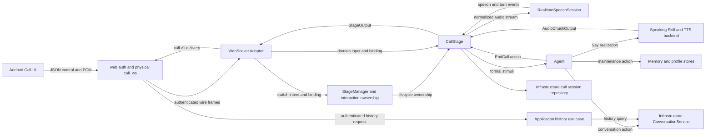
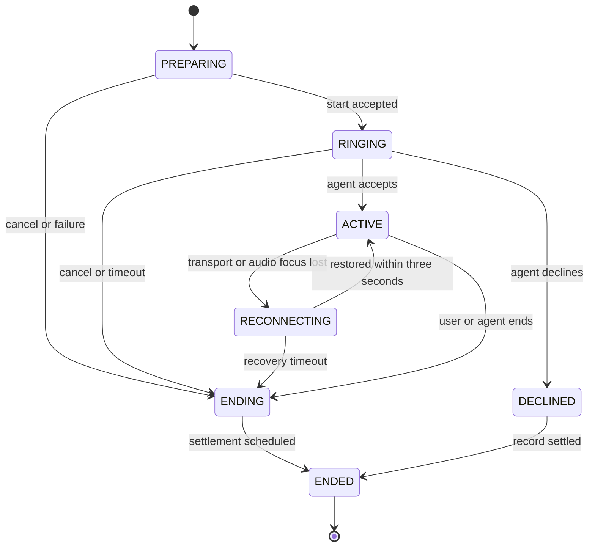

# Android 用户实时语音通话

> 状态：需求已确认，待实现  
> 平台：仅 Android 手机端  
> 协议版本：`call.v1`  
> UI 草图：[实时语音通话 UI 草图](assets/用户实时语音通话-ui.svg)

## 用户故事

1. 作为 Android 用户，我希望从聊天页菜单点击“给天依打电话”，以便进入实时语音通话。
2. 作为正在呼叫的用户，我希望看到头像、呼叫状态并听到呼叫音，也能在接通前挂断，以便明确系统正在建立通话且始终保有退出权。
3. 作为已经接通的用户，我希望全屏看到 Live2D 与背景、通话时长和挂断按钮，以便获得接近电话的沉浸体验。
4. 作为用户，我希望直接说话并快速听到天依的语音回答，以便自然连续交流，而不需要阅读或发送文字。
5. 作为用户，我希望说话时能打断天依，以便实时纠正、补充或改变话题。
6. 作为处于弱网环境的用户，我希望短暂断线后通话能继续，以便网络波动不直接丢失后续语音。
7. 作为沉默中的用户，我希望天依能在合适的时候主动提起话题，但不会仅因固定沉默次数机械挂断。
8. 作为结束通话的用户，我希望聊天历史出现一条简洁的通话记录，以便知道何时发生过通话及通话时长；通话内容只以概要参与后续上下文。
9. 作为隐私敏感的用户，我希望通话原始音频和完整逐字转录不被长期保存，以便降低敏感数据暴露风险。
10. 作为开发者，我希望通话协议、实时语音供应商、Agent 决策、TTS 和持久化边界彼此清晰，以便独立测试、替换和演进。
11. 作为开发者，我希望聊天与通话共用一致的认知维护机制，以便只在压缩点或交互结束时更新长期记忆和用户画像。

### UI/UX 草图


草图是布局和状态约束，不是像素级视觉稿。实现必须满足：

- `PREPARING` 与 `RINGING` 均使用深灰背景、居中头像、白色状态文字和底部红色挂断按钮，并循环播放呼叫音。
- `ACTIVE` 全屏展示现有背景图与 Live2D；顶部居中显示 `mm:ss`，底部保留红色挂断按钮。
- `RECONNECTING` 保持原通话画面和计时，在其上覆盖深色半透明提示层，不重新播放接通动画。
- 历史通话记录使用用户消息样式并向右对齐；已接通显示电话图标和 `[语音通话] 05:23`，接通前挂断显示 `[语音通话] 已取消`，拒接显示 `[语音通话] 未接听`，均不提供播放按钮。

## 验收标准

### AC-01 平台、入口与互斥

**状态**：Android 用户处于聊天页且不存在活动中的聊天请求或呼叫会话。  
**输入**：点击菜单按钮，再点击“给天依打电话”。  
**输出**：客户端进入通话页并请求麦克风权限；iOS、Web 和桌面端不显示该入口。

**状态**：同一用户与同一角色已有活动 `chat_ws` 或 `call_ws` 交互。  
**输入**：任意设备再次发起聊天或通话。  
**输出**：服务端原子地拒绝新交互，不抢占已有交互，不允许聊天和通话并存。唯一例外是当前已绑定聊天客户端预先登记、并由同一 `client_request_id` 关联的主动切换；该切换必须先完整回收旧 ChatStage，再创建 CallStage，任意其他设备不得借此终止已有聊天。

### AC-02 权限与呼叫建立

**状态**：首次进入通话页。  
**输入**：用户允许麦克风权限。  
**输出**：客户端生成 `client_request_id`，先通过仍已鉴权且已绑定的 `chat_ws` 发送 `call.switch_prepare`；收到 `call.switch_ready` 后断开 `chat_ws`，建立独立 `call_ws`，由 `web` 模块完成鉴权，然后使用同一 `client_request_id` 发送 `call.start`。不存在 ChatStage 时可以省略准备信号。

**状态**：WebSocket Adapter 收到 `call.switch_prepare`。  
**输入**：已鉴权且当前绑定同一用户、同一角色 ChatStage 的 `chat_ws`，以及尚未使用的 `client_request_id`。  
**输出**：StageManager 建立一次性、短期的 `CallTransitionIntent`，绑定 `user_id`、`character_id`、ChatStage `interaction_id` 和 `client_request_id`，然后返回 `call.switch_ready`。准备信号本身不创建呼叫账本、不终止 ChatStage；来自未绑定连接、其他角色或重复身份的请求被拒绝。

**状态**：`call.start` 命中同一用户、同一角色的现有 ChatStage。  
**输入**：与 `CallTransitionIntent` 完全匹配的 `client_request_id`。  
**输出**：StageManager 原子地消费切换意图、以 `client_request_id` 建立 `PREPARING` 状态的呼叫账本并生成稳定 `call_id`，然后把旧 ChatStage 从可复用集合移除，以新增的 `InteractionEndingReason.SWITCH_TO_CALL` 立即终止。此时 `PREPARING` 包含回收旧聊天资源的阶段，但尚未创建 CallStage。终止过程取消正在进行的 handle/realize、回复期限、未完成输出和未执行计划；`READY` pending 不再产生聊天回复，其已经形成的正式 Conversation 事实参与结束认知维护；尚未完成预处理且未形成正式事实的输入被取消并丢弃。结束处理完成或超时后必须关闭旧 InteractionContext，随后才允许把交互所有权交给 CallStage。

**状态**：旧 ChatStage 的结束认知维护达到终止期限。  
**输入**：`SWITCH_TO_CALL` 结束处理尚未完成。  
**输出**：取消结束处理并关闭旧 InteractionContext，认知维护进度保持原值，已落库 Conversation 事实由以后创建的聊天上下文重试维护；不得为了等待维护而让旧 ChatStage 与 CallStage 同时存活。若剩余呼叫准备时间足够则继续初始化 CallStage，否则按 10 秒呼叫建立超时结束且不创建通话记录。

**状态**：切换意图已消费且旧 ChatStage 已回收，但后续 CallStage 或实时语音会话初始化失败，或者用户在接通前挂断。  
**输入**：客户端返回聊天页并重新连接 `chat_ws`。  
**输出**：不得恢复已经终止的 ChatStage；StageManager 创建新的 ChatStage 与新的 InteractionContext，并从正式持久化事实恢复聊天上下文。

**状态**：`call.start` 没有匹配的切换意图，但同用户、同角色仍有 ChatStage，包括普通网络断线后保留 60 秒的 `OFFLINE` Stage。  
**输入**：其他设备或未完成准备流程的客户端尝试发起通话。  
**输出**：拒绝 `call.start`，不得回收或抢占旧 ChatStage。普通意外断线仍沿用现有 60 秒离线保留和重连行为，只有经过 `call.switch_prepare` 的主动切换才立即回收。

**状态**：用户拒绝麦克风权限。  
**输入**：普通拒绝或永久拒绝。  
**输出**：普通拒绝返回聊天页；永久拒绝额外提供前往系统设置的入口；两者均不创建通话记录。

**状态**：服务端收到重复的同用户、同角色、同 `client_request_id` 的 `call.start`。  
**输入**：客户端因超时重试发起相同请求。  
**输出**：服务端先按 `client_request_id` 查询既有呼叫账本；命中且用户、角色一致时返回相同 `call_id`，不要求切换意图仍然存在，也不新建第二个 CallStage、呼叫账本或 Conversation 条目。未命中账本时才进入切换意图校验。

### AC-03 接通前体验

**状态**：呼叫处于 `PREPARING` 或 `RINGING`。  
**输入**：等待服务端初始化实时语音会话、CallStage 和 Agent 接听决策。  
**输出**：显示深灰背景、现有天依头像、呼叫状态和红色挂断按钮，并循环播放呼叫音；从 `call.start` 起最迟 10 秒得到接通或终止结果，权限交互时间不计入该 10 秒。

**状态**：呼叫尚未进入 `ACTIVE`。  
**输入**：用户点击挂断。  
**输出**：立即停止呼叫音并返回聊天页；创建结果为 `CANCELLED_BEFORE_ANSWER` 的通话记录。

**状态**：呼叫尚未进入 `ACTIVE`。  
**输入**：Agent 返回拒接。  
**输出**：停止呼叫音并返回聊天页；创建结果为 `DECLINED` 的通话记录。第一版 Agent 默认接听，但接口必须保留拒接能力。

**状态**：呼叫在接通前因鉴权、并发占用、供应商初始化或系统故障失败。  
**输入**：服务端返回稳定错误码。  
**输出**：返回聊天页并提示失败，不创建 Conversation 通话记录。

### AC-04 接通与音频环境

**状态**：服务端确认进入 `ACTIVE`。  
**输入**：客户端收到 `call.active`。  
**输出**：停止呼叫音；全屏展示现有背景与 Live2D；顶部显示从 `connected_at` 开始的 `mm:ss`；底部显示红色挂断按钮；保持屏幕常亮并锁定竖屏。

**状态**：通话进入 `ACTIVE`。  
**输入**：系统允许通信音频会话。  
**输出**：Android 启用通信音频模式、AEC 和噪声抑制，遵循系统路由；第一版不提供静音、扬声器或设备选择按钮，音量键调节通话播放音量。

**状态**：首次进入 `ACTIVE`。  
**输入**：CallStage 向 Agent 提交 `CallStarted`。  
**输出**：Agent 产生简短开场语并经 CALL 音频通道播放；不在聊天界面显示文字气泡。

### AC-05 通话上下文、实时理解与轮次

**状态**：CallStage 为新呼叫创建 `InteractionContext`。

**输入**：同一用户、同一角色在服务端 `requested_at` 之前的最新 Conversation 记录时间。

**输出**：仅当最新记录位于 `[requested_at - 3 分钟, requested_at]` 内时，才把现有 ConversationSummary 和最新最多 30 条 Conversation 记录作为只读 `base_snapshot` 纳入本次通话上下文，记录按时间正序提供给 Agent；若最近 3 分钟没有新增记录，则通话对话上下文从空 `ConversationSnapshot` 开始。用户画像和按需记忆召回不受该条件影响。该读取不得修改 Conversation 表或其持久化摘要。

**状态**：通话使用 `InteractionContext.conversation` 追加用户轮次或正式 Agent 回复。

**输入**：通话逐字转写、声音描述、情绪及 Agent 回复文本。

**输出**：ContextFactory 为通话选择 `EphemeralCallConversationStore`；`ConversationContext.append()` 只更新本次呼叫的内存工作快照，不调用 ConversationService，不新增逐轮 Conversation 记录，也不写入 Redis、呼叫账本或媒体库。通话本地条目标识只用于本次呼叫内的排序、打断和维护幂等，不代表数据库行。

**状态**：通话工作上下文达到压缩阈值。

**输入**：`ConversationCompaction`。

**输出**：`ConversationContext.compact()` 只替换 `EphemeralCallConversationStore` 内的工作摘要和近期轮次，不调用 ConversationService，不覆盖全局 ConversationSummary；统一认知维护仍可把成功提取的长期记忆、用户画像和 `maintenance_turn_seq` 分别写入其正式存储。

**状态**：通话为 `ACTIVE` 且用户说话。  
**输入**：客户端持续发送 PCM16、16 kHz、单声道音频。  
**输出**：实时语音适配器输出规范事件 `speech_started`、`speech_stopped`、`turn_completed`、`turn_invalid`、`ambient_audio` 或 `provider_failed`；供应商生成的回答文本或音频一律取消并丢弃。

**状态**：适配器完成一个有效用户轮次。  
**输入**：`transcript`、`emotion`、`sound_description` 三个字段，其中至少一个非空。  
**输出**：CallStage 生成 `CallTurnCompleted` 刺激；Agent 获得统一的音频语义描述，不接触供应商 SDK 类型。

音频语义拼接规则：

| transcript | emotion | sound_description | Agent 上下文文本 |
| --- | --- | --- | --- |
| 有 | 有 | 可选 | `用户带着{emotion}的情绪说：“{transcript}”`，有声音描述时追加 `；{sound_description}` |
| 有 | 无 | 可选 | `用户说：“{transcript}”`，有声音描述时追加 `；{sound_description}` |
| 无 | 可选 | 有 | `{sound_description}`，有明确情绪时追加 `；情绪：{emotion}` |

模型应尽可能逐字转写；缺失的情绪或声音描述可以为 `null`，不得为了补齐字段额外调用一次大模型。

### AC-06 快速决策、记忆召回与首包延迟

**状态**：Agent 收到 `CallTurnCompleted`。  
**输入**：当前通话上下文、用户画像和容量默认 10 的通话记忆池。  
**输出**：`CallRecallDecisionSkill` 返回 `DIRECT` 或 `RECALL`，同时返回 `ack_style`；该 Skill 不生成正式回复、不写记忆、不直接改变 Stage。

**状态**：快速决策为 `DIRECT`。  
**输入**：当前上下文和整个通话记忆池。  
**输出**：回复 Agent 直接作答，不额外查询向量数据库，也不改变记忆池的使用顺序。

**状态**：快速决策为 `RECALL`。  
**输入**：`memory_queries` 和 `ack_style`。  
**输出**：系统立即播放与 `ack_style` 对应的预批准短过渡语，同时执行一次向量记忆召回；正式回答在过渡语播放结束后开始且不重叠。过渡语标记为 `provisional`，不参与概要、画像或长期记忆提取。

**状态**：向量召回返回新命中。  
**输入**：命中的记忆标识与内容。  
**输出**：命中按顺序放到记忆池尾部；再次命中已有记忆时将其移动到尾部；超出容量时淘汰头部最旧记忆。

**状态**：正常网络和设备条件下完成一个有效轮次。  
**输入**：`turn_completed` 时间点。  
**输出**：服务端发出第一个有效 TTS 音频块的 P95 不高于 2 秒；Android 开始播放的 P95 不高于 2.3 秒。`RECALL` 的过渡语可计入首包指标，但必须另记 `formal_reply_latency`；端点判断延迟单独统计。

### AC-07 Agent 回复与双通道路由

**状态**：Agent 在通话中执行 `Say`。  
**输入**：正式回复或回忆过渡语。  
**输出**：输出必须带 `audio_route=CALL`、`display_in_chat=false`、`is_ephemeral=true`；客户端只播放音频并驱动口型，不显示文字、不落客户端媒体缓存、不写普通聊天气泡。

**状态**：客户端收到服务端音频。  
**输入**：包含 `audio_route`、`stream_id`、`response_id`、`seq`、编码、采样率、声道数和结束标记的消息。
**输出**：`CHAT` 进入现有聊天音频处理器，`CALL` 进入独立通话音频处理器；两个处理器不共享队列和取消状态。旧 `agent_message` 缺少路由时仅可兼容为 `CHAT`，绝不得猜测为 `CALL`。

**状态**：客户端已收到某个 `stream_id` 的 final 音频帧。

**输入**：该话语的最后一个 PCM 采样已经被 Android 播放管线实际消费，而不只是完成下载、解码或进入播放队列。

**输出**：客户端发送一次有序、可重试的 `playback.completed(response_id, stream_id)`；服务端只有在 WebSocket Adapter 校验消息且 CallStage 幂等接纳播放结算后，才通过普通传输 ACK 覆盖该消息的客户端序号。ACK 丢失时客户端以相同 `seq` 和内容重发，重复接纳不得重复移除待播放项或重置沉默时钟。该消息是 Stage 协调输入，不转换为 Agent Stimulus。

### AC-08 用户打断

**状态**：天依音频正在合成或播放。  
**输入**：实时语音供应商确认 `speech_started`。  
**输出**：服务端立即发送带 `response_id`、`stream_id` 和该回复已分配服务端序号范围的 `playback.stop`，取消当前 Agent 处理与 TTS 请求，丢弃迟到音频，并记录 `UserInterrupted` 交互事实；客户端不等待更早序号缺口补齐就处理该停止帧，立即停止当前播放源、清空所有尚未播放的该回复音频，并把声明范围结算为不再需要接收。

**状态**：TTS 已在生成一个尚未完成的音频块。  
**输入**：收到取消。  
**输出**：200 ms 内停止发送新块；无法中止生成的半成品块不得发送。客户端保留已取消 `response_id` 的 tombstone，重连或迟到包不得恢复该回复。

### AC-09 沉默、角色挂断与通话上限

**状态**：CallStage 已为一个或多个服务端话语登记待播放项。
**输入**：客户端依次提交 `playback.completed`，或被打断的话语通过 `playback.stopped` 完成取消结算。
**输出**：CallStage 按 `(response_id, stream_id)` 幂等移除对应待播放项。只要仍有未结算话语、待发送话语、正在生成的 Agent/TTS 回复、有效用户语音或尚未完成的用户轮次，就不得启动沉默时钟。TTS 生成完成、final 音频发送完成和客户端收到 final 帧都不能替代实际播放完成。

**状态**：最后一个未取消话语的 `playback.completed` 已被 CallStage 接纳，且不存在其他待播放、待发送、生成中或用户发言状态。
**输入**：CallStage 记录该播放完成消息的首次接纳时间。
**输出**：从该服务端时间点启动 5 秒沉默时钟；后续重复完成消息不重置时钟。新的用户 `speech_started`、新回复生成或新 `audio.stream_started` 立即取消当前时钟；`RECONNECTING` 期间不运行沉默时钟。

**状态**：上述沉默时钟连续达到 5 秒。
**输入**：CallStage 生成 `CallSilenceElapsed`。  
**输出**：Agent 或快速判断返回 `SPEAK`、`WAIT` 或 `END_CALL`；不得使用固定沉默次数直接挂断。

**状态**：Agent 决定挂断。  
**输入**：`EndCall` 动作。  
**输出**：Agent 先自然告别；CallStage 必须收到最后一个告别话语的 `playback.completed`，确认客户端已经实际播放完成后再结束通话，而不能以 TTS 生成完成或 final 帧发出作为结束依据。

**状态**：已接通时长达到可配置上限，默认 30 分钟。  
**输入**：距上限 30 秒或达到上限。  
**输出**：距上限 30 秒时通过 Agent 给出提示；达到上限时服务端强制进入结束流程。

### AC-10 挂断、返回键与后台

**状态**：通话页为任意非终止状态。  
**输入**：用户点击红色挂断按钮。  
**输出**：立即停止采集与播放并返回聊天页，服务端进入结束与异步结算流程。

**状态**：通话页为任意非终止状态。  
**输入**：用户按 Android 返回键。  
**输出**：显示确认对话框；返回键本身不等效于挂断。

**状态**：App 进入后台、进程被杀或系统不再允许前台通信音频。  
**输入**：生命周期事件。  
**输出**：结束通话，不提供后台通话或进程恢复。

### AC-11 三秒恢复

**状态**：`call_ws` 意外断开或音频焦点丢失。  
**输入**：客户端在 3 秒内使用同一 `call_id`、同一已鉴权用户和同一角色重新连接。  
**输出**：恢复原 CallStage、InteractionContext、记忆池、计时和音频流；不产生新的 Stimulus，也不要求 Agent 额外回复。

**状态**：恢复期间服务端仍在生成 TTS。  
**输入**：未发送或未确认的服务端音频。  
**输出**：每个回复最多保留 30 秒音频，全通话最多保留 4 MiB；达到上限时暂停消费 TTS，不淘汰最旧未确认包。恢复后先按统一连续结算游标重放未取消的缺失帧和必要的取消结算控制，再发送新帧；已由 `playback.stop` 废弃的音频 payload 不得重放。

**状态**：恢复期间用户仍在说话。  
**输入**：客户端最多缓存 3 秒尚未确认的麦克风 PCM。  
**输出**：恢复后重发，服务端先按序号去重和排序，再交给实时语音供应商。

**状态**：3 秒内未恢复。  
**输入**：恢复宽限期结束。  
**输出**：客户端和服务端都执行结束流程，丢弃未完成用户轮次；有效通话时长截止到初次断开时刻。成功恢复的波动计入同一次通话时长。

恢复不使用恢复令牌。每次新 `call_ws` 都必须正常鉴权，并同时校验 `call_id`、用户和角色；生产环境必须使用 TLS。更强的恢复凭证列为未来安全目标。

### AC-12 通话结束、概要与历史记录

**状态**：呼叫进入过 `ACTIVE`。  
**输入**：用户挂断、Agent 挂断、超时、供应商故障或无法恢复。  
**输出**：创建一条用户来源的 Conversation 通话记录；历史界面只显示通话时长，Agent 上下文显示 `[语音通话]<内容概要>`。

**状态**：呼叫未进入 `ACTIVE`，但用户主动挂断或 Agent 拒接。  
**输入**：终止结果。  
**输出**：分别创建 `[语音通话] 已取消` 或 `[语音通话] 未接听` 的用户 Conversation 条目，不显示 `00:00`。

**状态**：用户已经离开通话页。  
**输入**：服务端执行概要与认知维护。  
**输出**：UI 不等待结算；后台最多执行 15 秒。通话概要失败时重试一次，仍失败则使用固定内容“本次通话未能形成可用概要”；历史记录允许稍后通过刷新出现。

**状态**：概要生成成功。  
**输入**：已完成的正式通话轮次。  
**输出**：生成不超过 200 个中文字符的第三人称中性概要，包含主要话题、重要用户事实、明确情绪、约定和未决事项；不得包含过渡语、网络技术细节或无依据推断。没有有效对话时使用“本次通话未形成有效对话内容”。

### AC-13 CallContent 与逻辑身份

```python
class CallOutcome(Enum):
    CONNECTED = "connected"
    CANCELLED_BEFORE_ANSWER = "cancelled_before_answer"
    DECLINED = "declined"


@dataclass(frozen=True)
class CallContent:
    call_id: UUID
    outcome: CallOutcome
    active_duration_ms: int
    summary: str | None
    end_reason: str
    text: str = field(init=False)
```

**状态**：服务端结算可记录的呼叫。  
**输入**：`user_id`、`character_id`、`call_id` 和 `CallContent`。  
**输出**：Conversation `entry_id` 使用 UUIDv5 从 `(user_id, character_id, call_id)` 稳定派生；`source=USER`、`type=call`、时间为 `requested_at`。同一逻辑身份重复写入幂等且不重复增加计数；内容冲突返回稳定错误。

数据库 `content` 保存 Agent 上下文渲染文本，结构化字段保存到元数据；历史接口根据结构化字段返回展示文本，绝不把概要返回给客户端。

### AC-14 呼叫账本与崩溃结算

呼叫账本至少保存：

| 字段 | 说明 |
| --- | --- |
| `call_id`、`client_request_id` | 呼叫身份和启动幂等键 |
| `user_id`、`character_id` | 所有权与角色边界 |
| `state`、`outcome`、`end_reason` | 生命周期与结果 |
| `requested_at`、`connected_at`、`disconnected_at`、`ended_at` | 时间事实 |
| `active_duration_ms` | 有效通话时长 |
| `summary_status`、`maintenance_status` | 两条独立结算进度 |
| `conversation_id` | 幂等关联 Conversation |
| `maintenance_turn_seq` | 已完成认知维护的最后通话轮次 |
| `created_at`、`updated_at` | 审计时间 |

账本不保存原始音频、逐轮文本、完整逐字转录或通话工作摘要；`maintenance_turn_seq` 只是整数进度。

**状态**：服务端启动时发现陈旧呼叫账本。  
**输入**：账本状态为 `PREPARING`、`RINGING`、`ACTIVE`、`RECONNECTING` 或 `ENDING`。  
**输出**：`PREPARING/RINGING` 标记系统失败且不建 Conversation；其余状态标记异常结束，按最后更新时间估算有效时长，并创建概要为“本次通话因服务中断，未能形成可用概要”的用户通话记录，不恢复实时会话。

### AC-15 认知维护与现有聊天迁移

现有 `ReflectionSkill` 重命名并深化为 `CognitiveMaintenanceSkill`：

```python
async def maintain_if_compaction_needed(
    context: InteractionContext,
) -> MaintenanceReport: ...


async def maintain(
    context: InteractionContext,
    *,
    reason: MaintenanceReason,
) -> MaintenanceReport: ...
```

**状态**：ChatStage 或 CallStage 完成一次正式 Agent 回复。  
**输入**：Agent 行动计划中的认知维护动作。  
**输出**：调用 `maintain_if_compaction_needed`；未达到当前条目数阈值时不更新长期记忆或用户画像。当前阈值沿用超过 60 条、压缩后保留 30 条，按 Token 判断列为未来计划。

**状态**：达到压缩阈值。  
**输入**：上下文中待压缩前缀以及持久化认知维护进度。  
**输出**：被覆盖前缀全部参与工作摘要，但仅把进度之后的新记录用于提取向量记忆和更新用户画像。聊天上下文通过 `DatabaseConversationStore` 持久化压缩；通话上下文通过 `EphemeralCallConversationStore` 只应用内存压缩。长期记忆和画像全部写入成功后，CognitiveMaintenanceSkill 才分别把聊天认知维护进度推进至该批最后一条被覆盖 Conversation 记录，或把呼叫账本的 `maintenance_turn_seq` 推进至该批最后一个已维护轮次；通话路径不得持久化逐轮内容或通话工作摘要。

**状态**：Stage 即将销毁。  
**输入**：`InteractionEnding` 刺激。  
**输出**：Agent 产生认知维护动作并调用 `maintain`，即使短对话未达到压缩阈值也处理进度之后的全部新内容；Stage 不得直接调用 Skill。

**状态**：主动切换通话导致旧 ChatStage 以 `SWITCH_TO_CALL` 终止。

**输入**：旧 ChatStage 的最终持久化聊天上下文与 `READY` pending 对应的已落库 Conversation 事实。

**输出**：Agent 先执行旧聊天的结束认知维护，不产生用户可见输出；无论维护成功、失败还是超时，旧 InteractionContext 都必须关闭后才创建通话 InteractionContext，因此两个上下文不得同时存活。维护失败或超时时不推进认知维护进度，后续聊天上下文可以根据持久化进度重试；通话 `base_snapshot` 只用于回答，不得把旧聊天事实再次作为本次通话的新维护内容。

**状态**：向量记忆或画像写入失败。  
**输入**：维护批次。  
**输出**：不推进持久化维护进度；ChatStage 在后续生命周期重试。CallStage 重试一次，仍失败则记录失败并在 15 秒期限后清除临时转录和记忆池。

向量候选使用 `(maintenance_id, candidate_index)` 幂等；画像使用完整值幂等写入。只有数据库成功后，才通过 InteractionContext 的正式接口更新当前用户画像。通话概要生成与认知维护基于同一不可变终态快照并行执行，彼此成功与否互不阻塞；本次通话概要不参与本次维护，但作为 Conversation 条目参与以后全局聊天上下文的维护。

现有显式“请记住这些事”能力保持原行为；本功能不新增一句话级别的“请记住”识别，也不把它并入通话快速决策。

### AC-16 失败降级

| 失败点 | 第一版行为 |
| --- | --- |
| 实时语音初始化失败且未接通 | 结束呼叫，不创建 Conversation |
| `ACTIVE` 中供应商失败 | 结束通话，使用已完成轮次生成概要并创建记录 |
| 快速决策失败 | 降级为 `RECALL` |
| 向量召回失败 | 使用当前上下文与现有记忆池正式回复 |
| 主回复失败一次 | 播放预录歉意语，保持通话 |
| 单次 TTS 失败 | 重试一次；仍失败则客户端播放内置错误音，保持通话 |
| 主回复或 TTS 连续失败两轮 | 结束通话 |
| `playback.completed` ACK 丢失 | 客户端以相同 `seq` 和内容重发；CallStage 幂等接纳且不重置沉默时钟 |
| 客户端未提交播放完成 | 不得按 TTS 时长或服务端超时推断用户已经听完；保持沉默时钟关闭，直到完成回执、取消结算或其他既有结束条件发生 |
| 概要失败 | 重试一次，再使用固定失败概要 |
| 认知维护失败 | 不阻塞 Conversation 记录，按 AC-15 重试与清理 |

### AC-17 隐私、删除与日志

**状态**：实时通话进行或结算。  
**输入**：PCM、转录、上下文、概要。  
**输出**：原始 PCM、Base64、完整转录和完整上下文不得写入普通日志；日志仅记录尺寸、序号、时长、状态、稳定错误码和关联 ID。阿里云实时语音服务会接收用户音频，隐私说明必须披露该事实。

**状态**：通话轮次被追加、压缩或执行认知维护。

**输入**：用户逐字转写、声音描述、情绪、Agent 逐轮回复和通话工作摘要。

**输出**：上述逐轮内容只存在于 `EphemeralCallConversationStore` 内存中，不得写入 Conversation 表、ConversationContext 持久化摘要、Redis、`call_sessions` 或任何新建转录表。允许长期保存的通话内容只有最终单条 `CallContent` 概要、成功提取的向量记忆和用户画像；不得以调试、恢复或统一接口为由绕过该约束。

**状态**：通话结束并完成或超时结算。  
**输入**：CallStage 临时数据。  
**输出**：服务端不保存音频文件；清除临时逐字转录和通话记忆池。默认管理界面不展示概要或逐字转录。

**状态**：执行账户完全重置或账户删除。  
**输入**：用户所有权范围。  
**输出**：删除呼叫账本、Conversation 通话记录、通话概要，以及由对应维护批次生成的长期记忆和画像数据；不得残留孤立关联。

### AC-18 可观测性

必须按 `call_id` 关联并采集以下无内容指标：状态耗时、供应商端点判断耗时与错误、首个有效音频延迟、正式回复延迟、TTS 耗时、final 帧发出到客户端实际播放完成的积压时长、播放完成 ACK 重试、打断次数、停止确认耗时、重连次数与结果、缓冲字节、概要和认知维护结果、供应商用量与成本。指标与日志不得包含音频、逐字转录、完整概要或完整上下文。

### AC-19 测试

- 单元测试：状态机、快速决策、记忆池近似 LRU、`CallContent` 渲染、UUIDv5 身份、概要约束、认知维护进度和幂等；分别验证 Database 与 Ephemeral Store 的 `append/compact` 可观察语义。
- 服务端集成测试：鉴权、进程内交互租约、混合帧协议、统一连续结算游标、ACK/NACK、重传、3 秒恢复、打断、异步结算、账户重置；覆盖控制/音频交错时的缺口恢复、取消范围越过音频缺口立即停止、推进游标并释放 payload，以及 TTS 快于播放、多话语排队、完成 ACK 丢失和重复完成时只在最后实际播放完成后启动一次沉默时钟；通话中及结算后断言 Conversation、ConversationContext、Redis、呼叫账本和媒体库均不存在逐轮转录或工作摘要。
- 上下文初始化测试：最新 Conversation 记录在 3 分钟边界内时按时间正序加载最新最多 30 条及现有摘要；超过边界、属于其他用户或角色时不加载；初始化读取不产生任何写操作。
- ChatStage 切换测试：只有当前已绑定聊天客户端登记的 `CallTransitionIntent` 能触发 `SWITCH_TO_CALL`；其他设备、错误角色、重复或缺失意图均不能抢占现有 ChatStage。
- ChatStage 回收测试：匹配的 `call.start` 立即取消旧 Stage 的处理、期限、计划和输出，`READY` pending 不再回复但已落库事实参与结束维护；旧 InteractionContext 关闭后才创建 CallStage。维护失败或超时时进度不推进，且任何时刻不得同时存在聊天与通话两个 InteractionContext。
- 普通断线回归测试：没有 `call.switch_prepare` 的 `chat_ws` 意外断开仍保留 ChatStage 60 秒并支持原有重连，不得被误判为主动切换。
- Agent 集成测试：`DIRECT`、`RECALL`、回忆过渡语、沉默决策、结束维护动作。
- Android 自动化测试：权限、入口、系统音频路由、打断停止、仅在最后一个 PCM 采样被播放管线消费后发送 `playback.completed`、完成 ACK 丢失重试、返回键确认、重连覆盖层、历史右对齐记录。
- 端到端测试：使用假的实时语音适配器、Agent 和 TTS，覆盖完整呼叫；允许提供仅测试用途的 `call_ws` 驱动器，不提供面向用户的 CLI 通话功能。
- 真实阿里云、真实设备 AEC、蓝牙路由和 2 秒延迟目标通过独立 smoke/performance 测试验证，不作为普通 CI 的稳定前提。

## 模块与架构

### 当前基线

- 服务端目前只有 `/chat_ws`，Stage 以 ChatStage 为主，没有 CallStage 与 `call.v1`。
- 现有 `adapter.websocket.WebSocketAdapter` 已经承担聊天信道的协议转换、逻辑交互绑定和异步输出投递；通话应扩展这一既有 Adapter 模块，而不是让 Web 绕过 Adapter 直连 CallStage。
- Android 聊天页目前没有电话入口；现有 WebView 音频链路面向普通聊天播放。
- 现有 Conversation 内容类型没有通话内容。
- 现有反思流程会在普通聊天回复后频繁执行记忆、压缩和画像更新，本功能要求迁移为统一认知维护边界。
- 现有 TTS 链路需要补充请求级取消、未完成块丢弃和 CALL 路由字段。

### 目标架构图



图中 `web` 只负责鉴权、物理连接和帧收发；既有 WebSocket Adapter 负责 `call.v1` wire 消息与领域输入/输出之间的转换、`call_id` 到逻辑交互的绑定，以及有序、带背压的输出投递。StageManager 负责切换意图、唯一交互所有权与 Stage 生命周期，CallStage 负责实时通话生命周期，Agent 负责理解后的认知决策；`RealtimeSpeechSession` 只做语音感知，不产生可见回答。历史查询由 Application 用例编排，底层 Conversation 持久化仍属于 Infrastructure。

### 生命周期



`FAILED` 是未形成可记录业务结果的终态，例如鉴权失败、并发拒绝和接通前供应商初始化失败。实现可以把 `DECLINED`、`FAILED` 作为终态结果而非长期驻留状态，但对外事件与持久字段必须稳定。

### 模块划分

| 模块 | 归属 | 职责 | 禁止承担 |
| --- | --- | --- | --- |
| Android Call UI | `app` | 状态页面、权限、采集、系统音频模式、计时、挂断与重连提示 | Agent 决策、概要、长期保存音频 |
| ChatAudioProcessor | `app` | 普通聊天 TTS、气泡、历史重放和现有缓存 | 播放 CALL 音频 |
| CallAudioProcessor | `app` | CALL PCM 播放、口型、实际播放完成检测、`playback.completed` 重试、取消 tombstone、ACK 与恢复 | 聊天气泡、媒体落盘、用下载或入队完成冒充实际播放完成 |
| call_ws endpoint | `web` | HTTP/WS 鉴权、物理连接生命周期、原始 JSON/二进制帧收发 | 把 wire 消息转成 Stimulus、绑定 CallStage、投递业务输出 |
| WebSocket Adapter | `adapter/websocket` | 扩展现有 Adapter 以解析和校验 `call.v1`，把已鉴权 wire 输入转换为 CallStage 可接收的领域输入，维护连接与 `call_id`/逻辑交互的绑定，并把 StageOutput 转成有序信道消息完成 ACK、NACK、重传和背压投递 | 拥有物理连接、执行鉴权、判断角色回复、维护回复批次 |
| InteractionLeaseRegistry | `stage` | 由 StageManager 一侧持有，按同用户、同角色原子授予唯一交互所有权；主动切换期间以 `CallTransitionIntent` 保留过渡占用，旧 ChatStage 终止且 Context 关闭后才把所有权交给 CallStage | 分布式协调、接受未经当前绑定验证的客户端切换声明 |
| CallStage | Stage | 状态机、PCM 顺序与背压、轮次、待播放项、沉默时钟、打断、恢复、播放结算、资源关闭 | 直接访问阿里 SDK、直接调用 Skill、用 TTS 生成进度推测客户端播放完成 |
| RealtimeSpeechSession | `infrastructure/models/realtime_speech` | 把供应商实时 ASR/VAD 事件归一化为稳定领域事件 | 生成天依回复、写 Conversation |
| CallRecallDecisionSkill | Agent Skill | 判定 `DIRECT/RECALL`，生成检索条件与过渡语类别 | 正式回答、写记忆、改变 Stage |
| Agent | Agent | 接听、回复、沉默行动、挂断、概要和认知维护行动计划 | 处理 PCM 包序与 WS 帧 |
| Speaking Skill 与 TTS backend | `agent/skills/expression/speaking` | 作为角色说话能力合成 24 kHz 单声道 PCM，管理后端与进程并支持请求级取消 | 归入通用 Infrastructure、猜测聊天与通话路由 |
| CognitiveMaintenanceSkill | Agent Skill | 压缩、记忆提取、画像更新、维护批次幂等 | 每轮无条件写长期记忆 |
| ConversationContext 与 Store | `agent/context` | 向 Agent 和认知维护提供统一的 `read/append/compact` 行为；由 ContextFactory 按交互类型注入 Database 或 Ephemeral Store | 让调用方在每次追加时决定是否持久化、把通话转录写入数据库 |
| Call session repository | `infrastructure/persistence` | 呼叫账本、启动幂等、恢复与结算进度 | 保存音频或完整转录、编排呼叫用例 |
| ConversationService | `infrastructure/persistence/database/services` | Conversation 与上下文的底层持久化、稳定 UUID 写入和查询事实 | 历史 HTTP 用例编排、决定客户端展示字段 |
| UserConversationHelper | `application/user` | 编排用户历史查询，把底层 Conversation 事实投影为客户端可见记录并隐藏通话概要 | 承担数据库实现、向 Agent 提供认知上下文 |

`ConversationContext` 保持同一接口并通过组合选择两个内部 Store：聊天使用 `DatabaseConversationStore`，延续当前追加和压缩落库行为；通话使用 `EphemeralCallConversationStore`，只把满足最近 3 分钟条件的持久化快照作为初始化种子，此后的追加和压缩全部留在内存。`InteractionContext` 继续作为用户、对话和召回上下文的聚合模块，不作为基类，也不在 `append()` 或 `compact()` 上增加容易误用的 `persist` 参数。

### ChatStage 到 CallStage 的原子切换

主动切换不是普通 WebSocket 断线。当前已鉴权并绑定 ChatStage 的 `chat_ws` 必须先提交 `call.switch_prepare`；StageManager 据此创建一次性、短期 `CallTransitionIntent`，并把同用户、同角色的交互所有权标记为正在切换。收到 `call.switch_ready` 后，该聊天绑定不再接受新的业务输入，只允许完成断连或等待意图过期。意图只能由同一用户、同一角色、同一 `client_request_id` 的 `call.start` 消费，不能作为恢复令牌，也不能被其他设备用于抢占。

匹配的 `call.start` 必须先把旧 ChatStage 从可复用集合移除，以 `SWITCH_TO_CALL` 执行终止和结束认知维护，并关闭旧 InteractionContext；只有这些步骤完成或达到本次切换期限后，StageManager 才能把交互所有权交给新的 CallStage。该终止不得沿用 ChatStage 默认 30 秒终止等待，而必须受 `call.start` 起算的 10 秒呼叫建立总期限约束；超时即取消维护、保持维护进度不变并关闭旧 Context。聊天 Context 与通话 Context 不得同时存活。旧 Stage 一旦进入该终止路径便不可恢复；通话初始化失败或接通前取消后，重新连接聊天必须创建新 ChatStage。

未经过 `call.switch_prepare` 的 `chat_ws` 意外断开不属于主动切换，继续沿用现有 60 秒离线保留和重连行为。有效意图过期且原聊天连接仍在时，Adapter 解除切换状态并恢复接收聊天输入；原连接已经断开时，StageManager 按普通离线行为处理。第一版仅支持单一 ServerRuntime；若配置为多 worker，启动检查必须禁用通话或拒绝启动通话能力，不能静默依赖进程内互斥。分布式协调属于极远期且低概率需求。

### 呼叫建立顺序

1. 用户从菜单进入通话页，客户端申请麦克风权限。
2. 权限允许后，客户端生成 `client_request_id`，通过仍已鉴权且绑定的 `chat_ws` 发送 `call.switch_prepare`；Adapter 校验当前逻辑绑定，StageManager 创建 `CallTransitionIntent` 并返回 `call.switch_ready`。不存在 ChatStage 时跳过本步。
3. 客户端收到 `call.switch_ready` 后断开 `chat_ws`，连接 `call_ws`；`web` 模块完成正常鉴权，并把带同一 `client_request_id` 的 `call.start` 原始帧交给既有 WebSocket Adapter。
4. Adapter 先查询既有呼叫账本；首次请求由 StageManager 原子消费切换意图、建立 `PREPARING` 呼叫账本并生成稳定 `call_id`，再把旧 ChatStage 从可复用集合移除，以 `SWITCH_TO_CALL` 终止它，取消未完成工作并执行无用户可见输出的结束认知维护，最后关闭旧 InteractionContext。重复请求返回账本中的同一身份和当前状态。
5. 旧 Context 关闭后，StageManager 原子地把同用户、同角色的交互所有权交给 CallStage；Adapter 完成 `call_id` 与 CallStage 的逻辑绑定。账本继续处于 `PREPARING`，直到系统能力准备完成并进入 `RINGING` 或终止。
6. CallStage 通过 ContextFactory 创建使用 `EphemeralCallConversationStore` 的 InteractionContext；仅当同用户、同角色的最新 Conversation 记录位于最近 3 分钟时，加载现有摘要与最新最多 30 条记录作为只读初始化种子，同时预热基础画像并创建实时语音会话。
7. 系统能力准备完成后，才请求 Agent 的接听决策；第一版固定接受，但保留拒接动作。
8. Agent 接受后进入 `ACTIVE` 并发送开场语；任一接通前终止路径都关闭 `call_ws`、释放通话所有权并返回聊天页。旧 ChatStage 不得复用，后续 `chat_ws` 连接创建新 ChatStage。

### Agent 与 Stage 职能边界

CallStage 只向 Agent 提交以下正式刺激：

```python
CallStarted(call_id, started_at)
CallTurnCompleted(call_id, turn_seq, audio_content)
CallSilenceElapsed(call_id, silence_ms)
CallEnding(call_id, reason, final_snapshot)
InteractionEnding(interaction_id, reason)
```

`speech_started` 和原始 PCM 不进入 Agent。Agent 第一版允许产生 `Say`、`ChangeExpression`、`EndCall` 以及不向聊天 UI 显示的常规长期业务动作；`Sing`、预制长音频和聊天气泡不允许在通话中执行。

`InteractionEndingReason` 新增 `SWITCH_TO_CALL`，专门表示经有效切换意图触发的主动交接；普通聊天离线超时继续使用既有 `USER_LEFT`，服务停止继续使用既有关闭原因。这里复用 `InteractionEnding`，不新增只为切换服务的 Stimulus 类型。

Stage 销毁链路必须为：

```text
Stage
  -> Agent.handle_stimulus(InteractionEnding)
  -> CognitiveMaintenance ActionPlan
  -> Agent.realize_action_plan(...)
  -> CognitiveMaintenanceSkill.maintain(...)
  -> close InteractionContext
```

### 实时语音抽象

```python
class RealtimeSpeechSession(Protocol):
    async def start(self, config: RealtimeSpeechConfig) -> None: ...
    async def push_audio(self, frame: AudioFrame) -> None: ...
    def events(self) -> AsyncIterator[RealtimeSpeechEvent]: ...
    async def close(self) -> None: ...


class RealtimeSpeechSessionFactory(Protocol):
    async def create(self, call_id: UUID) -> RealtimeSpeechSession: ...
```

首个实现位于 `infrastructure/models/realtime_speech`，可使用支持实时端点判断的阿里云模型，但 Spec 不绑定具体 Qwen Realtime 型号。另提供内存测试适配器。供应商若自动生成回答，适配器必须立即取消并丢弃，禁止进入 Agent、客户端或 Conversation。

### 快速决策接口

```python
class RecallMode(Enum):
    DIRECT = "direct"
    RECALL = "recall"


class AckStyle(Enum):
    NONE = "none"
    THINKING = "thinking"
    EMPATHY = "empathy"
    CONFIRMING = "confirming"


@dataclass(frozen=True)
class CallRecallDecision:
    mode: RecallMode
    memory_queries: tuple[str, ...]
    ack_style: AckStyle
```

第一版可由现有快速模型实现。未来应优先调研独立本地 Judge；候选包括社区项目 AgentJev-0.6B。它是基于 Qwen3-0.6B 的社区决策模型，不等同于 TypeSafe 官方 Jev 的本地发行，不能在完成本项目数据集验证前直接用于生产路由。

### 接口规范

以下 `call.v1` wire 格式由现有 `adapter.websocket` 模块负责解释和生成。`web` 只向 Adapter 提供已鉴权连接和原始帧，并发送 Adapter 产出的信道消息。第一版允许在现有 Adapter 内增加通话专用解析与投递实现，但不新增只做参数转发的 `CallAdapterPort`；只有出现第二种真实信道实现时，才重新评估是否需要新的稳定 seam。

#### 1. call.switch_prepare

该消息通过当前已鉴权并绑定 ChatStage 的 `chat_ws` 发送：

```json
{
  "protocol": "call.v1",
  "type": "call.switch_prepare",
  "client_request_id": "018f4ca2-4c9d-7ad8-8f2f-941f73d6d82a",
  "character_id": "luotianyi"
}
```

成功响应为 `call.switch_ready`，必须回显 `client_request_id`。服务端创建的 `CallTransitionIntent` 仅存在于内存，只能使用一次，绑定已鉴权用户、角色、当前 ChatStage `interaction_id` 与该请求 ID，并在从 `call.switch_ready` 开始的 10 秒呼叫建立期限内有效。它不是 `call.resume` 的恢复令牌；缺失、过期、重复消费或绑定不匹配时，`call.start` 必须以稳定错误码失败，且不得终止现有 ChatStage。

#### 2. call.start

```json
{
  "protocol": "call.v1",
  "type": "call.start",
  "seq": 1,
  "client_request_id": "018f4ca2-4c9d-7ad8-8f2f-941f73d6d82a",
  "character_id": "luotianyi",
  "audio": {
    "encoding": "pcm_s16le",
    "sample_rate": 16000,
    "channels": 1
  }
}
```

处理 `call.start` 时，服务端先按 `client_request_id` 查询呼叫账本：若已存在且用户、角色一致，返回原 `call_id` 与当前建立状态；若同用户、同角色存在 ChatStage，则尚无账本的首次请求必须消费匹配的 `CallTransitionIntent`，并在终止 ChatStage 前建立 `PREPARING` 账本；若不存在任何 ChatStage 且交互所有权空闲，则可以不带切换意图直接建立账本。成功响应必须包含服务端生成的 `call_id`。未知协议版本使用稳定错误码拒绝，不进行猜测兼容。

#### 3. call.resume

```json
{
  "protocol": "call.v1",
  "type": "call.resume",
  "call_id": "606ec5e6-a330-4e6c-b07a-8432a5716c8f",
  "character_id": "luotianyi",
  "last_contiguous_server_seq": 60
}
```

恢复成功响应：

```json
{
  "protocol": "call.v1",
  "type": "call.resumed",
  "call_id": "606ec5e6-a330-4e6c-b07a-8432a5716c8f",
  "character_id": "luotianyi",
  "last_contiguous_client_seq": 96,
  "last_contiguous_server_seq": 60
}
```

恢复授权依赖新连接的正常鉴权，以及同一 `call_id`、同一用户、同一角色三项同时匹配。第一版不使用恢复令牌。`call.resume` 与 `call.resumed` 是重新绑定传输的握手，不占用通话会话任一方向的 `seq`。客户端使用 `last_contiguous_server_seq` 声明已经连续结算的服务端帧；服务端在 `call.resumed` 中回传已经连续结算的客户端帧游标，并回显其接纳的服务端游标。握手完成后，双方先重放对端游标之后仍需交付的原序号帧，再发送新帧。

#### 4. 服务端音频流开始

```json
{
  "protocol": "call.v1",
  "type": "audio.stream_started",
  "seq": 43,
  "call_id": "606ec5e6-a330-4e6c-b07a-8432a5716c8f",
  "audio_route": "CALL",
  "stream_id": 12,
  "response_id": "resp_01k",
  "encoding": "pcm_s16le",
  "sample_rate": 24000,
  "channels": 1
}
```

一个 `stream_id` 表示客户端可以独立播放完成并确认的一句话或一个连续话语；同一 Agent `response_id` 可以按 TTS 分句产生多个依次播放的 `stream_id`。CallStage 在发送各自的 `audio.stream_started` 前登记待播放项，并在该流最后一个二进制音频帧上设置 `final`。登记发生在投递之前，因此即使 TTS 预先生成后续话语，CallStage 也知道仍有多少话语尚未被客户端实际播完。

#### 5. 二进制帧头

二进制帧由固定长度帧头和 PCM payload 组成。具体字节布局在实现 ADR 中冻结，但第一版必须包含：

| 字段 | 约束 |
| --- | --- |
| protocol version | 可拒绝未知版本 |
| audio route | `CHAT` 或 `CALL`，通话帧必须为 `CALL` |
| stream id | 与 `audio.stream_started` 绑定的短整数 |
| seq | 该方向跨控制帧和音频帧单调递增 |
| flags | 仅包含当前确有消费者的 `final` |
| payload length | 与实际 payload 严格一致 |

帧的方向由发送它的 WebSocket 端天然确定，不在帧头中重复编码。每个方向的会话业务控制帧和二进制音频帧共享一条从 1 开始严格递增的序列，并且只维护一个 `last_contiguous_seq`：小于等于该值的每个序号都必须已经收到并通过校验，或者已经由发送方的取消控制明确结算为不再交付。ACK 只携带这一连续结算游标，不分别确认业务控制帧和音频帧。

收到高于 `last_contiguous_seq + 1` 的普通帧时可以暂存，但必须对首个缺口发送 NACK，且不能越过缺口推进 ACK。发送方以原 `seq` 和原始帧内容重发，不设置额外重传标记。相同 `seq` 且内容相同的重复帧幂等忽略；相同 `seq` 但帧头或 payload 不同视为协议冲突，拒绝该帧并终止连接。恢复时使用的 `last_contiguous_server_seq` 和 `last_contiguous_client_seq` 与正常 ACK 的游标定义完全相同。

`ACK`、`NACK`、`call.resume` 和 `call.resumed` 是传输反馈或重新绑定握手，不分配 `seq`、不进入重放缓冲，也不触发对自身的确认。`ACK` 只携带 `ack_seq=<last_contiguous_seq>`；`NACK` 只携带当前首个 `missing_seq`。因此确认消息不会形成相互确认循环，恢复游标也不会因新连接的握手消息发生偏移。

例如服务端控制帧 42 已收到、音频帧 43 丢失、普通控制帧 44 已收到时，客户端只能确认 42、请求重传 43；若此时断线，`call.resume.last_contiguous_server_seq` 必须为 42。若 44 本身是合法的 `playback.stop` 且明确结算包含 43 的取消范围，则客户端立即执行停止并可把连续游标推进到 44。

#### 6. 播放完成

```json
{
  "protocol": "call.v1",
  "type": "playback.completed",
  "seq": 97,
  "call_id": "606ec5e6-a330-4e6c-b07a-8432a5716c8f",
  "response_id": "resp_01k",
  "stream_id": 12
}
```

客户端只能在对应流已经收到 `final`，并且最后一个 PCM 采样已被 Android 播放管线消费后发送该消息。下载完成、解码完成、写入播放器缓冲或服务端 TTS 完成均不满足条件。消息使用客户端到服务端的正常会话序号；Adapter 必须在 CallStage 接纳结算后才让普通 ACK 覆盖该 `seq`。ACK 丢失时客户端使用相同序号和内容重发；同一 `(response_id, stream_id)` 只允许首次接纳改变 CallStage 状态，重复消息只重放 ACK。

CallStage 只接纳已经登记、已经发送 final 且未取消的流。未知流或 final 尚未发送时返回稳定协议错误；已经完成的流幂等成功；已经由 `playback.stop` 取消结算的流不再要求播放完成，并对竞态到达的 `playback.completed` 幂等返回成功但不得启动或重置沉默时钟。

#### 7. 播放停止

```json
{
  "protocol": "call.v1",
  "type": "playback.stop",
  "seq": 61,
  "call_id": "606ec5e6-a330-4e6c-b07a-8432a5716c8f",
  "response_id": "resp_01k",
  "stream_id": 12,
  "retire_server_seq": {
    "from": 43,
    "through": 60
  },
  "reason": "user_interrupted"
}
```

服务端为一个回复分配的服务端序号范围必须连续，且范围内不得夹入属于其他回复或通话控制的帧；`retire_server_seq` 从该回复的 `audio.stream_started` 序号开始，到发送停止前最后一个已经分配的序号结束，`through` 必须小于 `playback.stop.seq`。未实际分配序号的半成品或尚未发送音频不产生缺口，也不进入该范围。

`playback.stop` 是允许越过更早缺口立即处理的取消控制。客户端确认范围内已经收到的帧均属于对应 `response_id` 和 `stream_id`；范围内尚未收到的帧以已鉴权服务端的取消声明为准。验证通过后，客户端立即建立 tombstone、停止播放、清空队列，并把范围内尚未收到的序号标记为已结算；随后把停止帧本身标记为已收到，重新计算统一连续游标并发送普通 ACK。若范围非法、与已经收到的其他回复或通话控制冲突，或者包含停止帧及其后序号，则视为协议冲突并终止连接。更早且不在取消范围内的缺口仍须重传，但不阻塞停止动作。

客户端另行回传包含 `call_id`、`response_id` 与 `stop_seq` 的 `playback.stopped` 作为正常的、有 `seq` 的会话业务控制帧；它不重复 `stream_id`，确认停止动作已经执行，但不代替统一 ACK 游标。服务端发出停止帧后，立即把取消范围内的音频 payload 从重传缓冲替换为轻量的范围结算记录，只保留 `playback.stop` 及其范围元数据，直到普通 ACK 覆盖停止帧或呼叫结束。断线恢复或收到针对已取消范围的 NACK 时，只重放对应的 `playback.stop`，不得重放已取消音频。停止确认耗时纳入指标；取消 tombstone 的生命周期至少覆盖整个呼叫会话。

#### 8. 共享控制契约

控制消息的完整字段、方向、传输、整数范围、稳定 parser 错误与规范编码顺序见 [`contracts/call_v1/control.schema.json`](../../contracts/call_v1/control.schema.json) 和 [`contracts/call_v1/fixtures/control_messages.json`](../../contracts/call_v1/fixtures/control_messages.json)。该契约仍随 ADR-0001 保持 Proposed；纯 parser 不承担序号单调性、首帧、重放或 Stage 状态校验。

#### 9. 结束事件

```json
{
  "protocol": "call.v1",
  "type": "call.ended",
  "seq": 88,
  "call_id": "606ec5e6-a330-4e6c-b07a-8432a5716c8f",
  "outcome": "connected",
  "end_reason": "user_hangup",
  "active_duration_ms": 323000
}
```

### 数据一致性与结算顺序

1. 当前聊天绑定提交 `call.switch_prepare` 后，StageManager 建立一次性 `CallTransitionIntent` 并保留同用户、同角色的过渡所有权；此时不创建呼叫账本，也不释放所有权给其他设备。
2. `call.start` 先按 `client_request_id` 读取既有呼叫账本；命中且身份一致时返回原 `call_id` 与当前建立状态。未命中且存在 ChatStage 时，必须原子消费匹配意图、建立 `PREPARING` 呼叫账本，再把旧 ChatStage 从可复用集合移除并以 `SWITCH_TO_CALL` 终止；结束认知维护完成或耗尽 10 秒呼叫建立期限时关闭旧 InteractionContext。未匹配的 `call.start` 不能改变旧 Stage。不存在 ChatStage 且所有权空闲时可直接幂等建立 `PREPARING` 账本。
3. 旧 Context 关闭后，StageManager 才把交互所有权交给 CallStage；随后创建使用 `EphemeralCallConversationStore` 的 InteractionContext 和实时语音会话。账本继续处于 `PREPARING`，最近 3 分钟上下文检查只读取 ConversationService，不写入任何对话数据。
4. 进入 `ACTIVE` 时持久化 `connected_at`；所有终止路径先冻结不可变终态快照。
5. 实时媒体资源关闭且终态快照冻结后释放通话所有权；客户端立即收到结束事件、返回聊天页并可重新连接 `chat_ws`，服务端为其创建新的 ChatStage，且在后台并行执行概要和认知维护。
6. 概要或固定回退文本准备好后，以稳定 UUID 写 Conversation，并关联 `conversation_id`。
7. 两条结算任务完成或达到 15 秒期限后清除临时转录与记忆池；后台结算不得继续占用实时交互租约。

## 备注

### 关键技术选型

- Android 原生通信音频模式、AEC 与噪声抑制；16 kHz 单声道上行、24 kHz 单声道下行。
- 独立 `call_ws` 与 `call.v1` 混合 JSON/二进制协议；`chat_ws` 与 `call_ws` 严格互斥。
- 使用一次性 `CallTransitionIntent` 证明切换来自当前聊天绑定；`call.start` 消费意图后立即终止并回收 ChatStage，旧 InteractionContext 关闭后才创建通话 Context。普通意外断线仍沿用既有 60 秒 ChatStage 恢复窗口。
- 阿里云实时语音能力作为首个 `RealtimeSpeechSession` 实现，但领域接口不绑定具体模型。
- Agent 主导回复、记忆、主动说话和挂断；实时语音供应商只负责语音感知。
- 延续现有 TTS 能力，新增请求级取消、CALL 路由、序号和未完成块丢弃。
- ConversationContext 通过两个 Store 复用同一认知接口：`DatabaseConversationStore` 服务聊天并持久化追加与压缩，`EphemeralCallConversationStore` 服务通话且只在内存追加、压缩逐轮内容；ContextFactory 在创建交互时完成选择，调用方不传逐次持久化开关。
- 通过呼叫账本与稳定 Conversation UUID 实现启动、恢复和结算幂等，不保存音频或完整逐字转录。
- Reflection 重命名并深化为 Cognitive Maintenance，只在压缩点和 Stage 销毁时提取记忆、更新画像。

### 非目标

- iOS、Web、桌面端电话入口或通话实现。
- 来电、后台通话、进程被杀后的实时恢复。
- 通话字幕、逐轮文字展示、音频下载、通话录音或重放。
- 静音、扬声器开关、手动蓝牙或音频设备选择。
- 唱歌、预制长音频、通话内普通聊天气泡。
- 说话人识别、声纹认证。
- 阿里云 AOQ 或 WebRTC 迁移。
- 客户端模型 Key、本地音频理解或本地图片理解。
- 多 worker、多节点和分布式租约。
- 按 Token 驱动上下文压缩。
- 面向用户的 CLI 实时通话。

### 未来目标

1. **优先调研独立 Judge**：尽快验证 Jev 思路的本地部署可行性，包含社区 [AgentJev-0.6B 代码仓库](https://github.com/malevrigns/agent-jev)及其[公开权重](https://huggingface.co/aimeigaoshou/agent-jev)等候选；建立项目自己的 `DIRECT/RECALL`、`SPEAK/WAIT/END_CALL` 标注集，评估中文能力、置信度校准、P95 延迟、资源占用和失败回退。先 shadow 运行，不能因“结构化概率输出”而假定判断正确。
2. 支持更强的通话恢复凭证与重放攻击防护；当前同 call、同用户、同角色恢复是第一版安全折中。
3. 评估阿里云 AOQ、WebRTC 或其他实时媒体通道，但不改变 Agent 与语音感知边界。
4. 支持 iOS、桌面端、来电、后台通话与设备路由控制。
5. 评估声纹与说话人识别，单独设计明确的注册、撤销、隐私和误识别边界。
6. 支持客户端配置模型 Key，在本地完成音频或图片理解并上传结构化理解结果。
7. 将上下文压缩阈值从条目数演进为 Token 与模型上下文预算。
8. 仅在确有多进程部署需求时评估分布式交互租约；该方向为极远期、低概率需求。

### 开发前置与文档同步

- 实现前为 `call.v1` 二进制帧布局建立 ADR，并冻结字节序、字段宽度、最大 payload 和稳定错误码。
- 实现时同步更新代码地图、数据库迁移说明、客户端与服务端协议测试夹具。
- `CognitiveMaintenanceSkill` 是跨聊天与通话的迁移，必须先用现有 ChatStage 回归测试锁定行为，再接入 CallStage。
- AgentJev-0.6B 是社区候选，其公开模型卡和仓库可用于调研起点，但不得把它表述为官方 Jev 的本地权重或未经验证的生产依赖。
